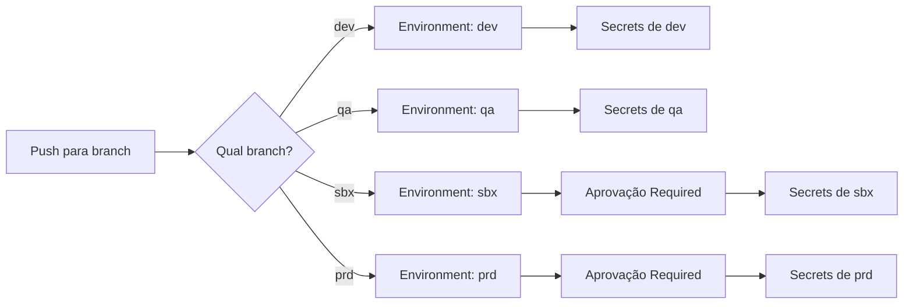
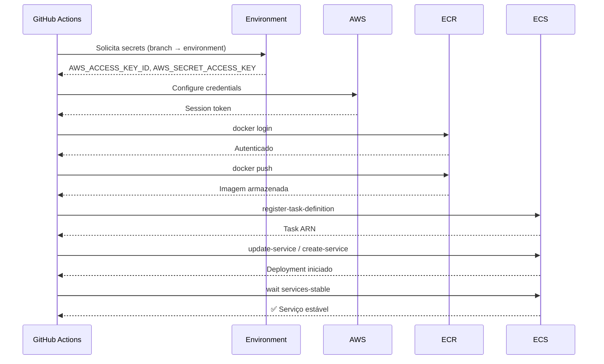

# 🔐 Configuração de GitHub Environments

Guia completo para configurar GitHub Environments, Secrets e Variables para o pipeline de CI/CD.

---

## 📋 Índice

- [Visão Geral](#-visão-geral)
- [Como Funciona](#-como-funciona)
- [Passo a Passo](#-passo-a-passo)
- [Referência de Configuração](#-referência-de-configuração)
- [Fluxograma de Autenticação](#-fluxograma-de-autenticação)
- [Troubleshooting](#-troubleshooting)

---

## 🎯 Visão Geral

### O que são GitHub Environments?

GitHub Environments são **contextos isolados** para deploy que permitem:
- 🔒 **Secrets segregados** por ambiente (dev, qa, sbx, prd)
- ✅ **Aprovações manuais** antes de deploys críticos
- 🔀 **Restrição de branches** para cada ambiente
- 📊 **Auditoria** de quem aprovou e quando

### Por que usar?

| Benefício | Descrição |
|-----------|-----------|
| **Segurança** | Credenciais de produção isoladas |
| **Governança** | Aprovação obrigatória para prd/sbx |
| **Rastreabilidade** | Histórico completo de deploys |
| **Zero Plain Text** | Nenhum secret exposto nos YAMLs |

---

## ⚙️ Como Funciona

### Arquitetura de Isolamento

```
┌─────────────────────────────────────────────────────────────────────┐
│                        GitHub Repository                             │
│  ┌───────────────────────────────────────────────────────────────┐  │
│  │                    GitHub Environments                         │  │
│  │  ┌─────────────┐ ┌─────────────┐ ┌─────────────┐ ┌──────────┐ │  │
│  │  │     dev     │ │     qa      │ │     sbx     │ │    prd   │ │  │
│  │  │ ─────────── │ │ ─────────── │ │ ─────────── │ │ ──────── │ │  │
│  │  │ Branch: dev │ │ Branch: qa  │ │ Branch: sbx │ │Branch:prd│ │  │
│  │  │ Approval: ❌│ │ Approval: ❌│ │ Approval: ✅│ │Approval:✅│ │  │
│  │  │             │ │             │ │             │ │          │ │  │
│  │  │ 🔑 Secrets  │ │ 🔑 Secrets  │ │ 🔑 Secrets  │ │🔑 Secrets│ │  │
│  │  │ AWS_KEY_DEV │ │ AWS_KEY_QA  │ │ AWS_KEY_SBX │ │AWS_KEY_PR│ │  │
│  │  │             │ │             │ │             │ │          │ │  │
│  │  │ 📝 Variables│ │ 📝 Variables│ │ 📝 Variables│ │📝Vars    │ │  │
│  │  │ ECR_REG_DEV │ │ ECR_REG_QA  │ │ ECR_REG_SBX │ │ECR_REG_PR│ │  │
│  │  └─────────────┘ └─────────────┘ └─────────────┘ └──────────┘ │  │
│  └───────────────────────────────────────────────────────────────┘  │
└─────────────────────────────────────────────────────────────────────┘
                                │
                                ▼
                    ┌─────────────────────┐
                    │   AWS (por conta)   │
                    │  ┌───────────────┐  │
                    │  │ dev account   │  │
                    │  │ qa account    │  │
                    │  │ sbx account   │  │
                    │  │ prd account   │  │
                    │  └───────────────┘  │
                    └─────────────────────┘
```

### Fluxo de Seleção de Environment



---

## 📝 Passo a Passo

### 1️⃣ Criar os Environments

1. Vá em **Settings > Environments** no repositório da aplicação
2. Clique em **New environment**
3. Crie os 4 environments: `dev`, `qa`, `sbx`, `prd`

### 2️⃣ Configurar Protection Rules

Para cada environment, configure:

#### dev / qa (sem aprovação)
```
Deployment branches: Selected branches
  └── dev (ou qa)
Wait timer: 0
Required reviewers: ❌ Desabilitado
```

#### sbx / prd (com aprovação)
```
Deployment branches: Selected branches
  └── sbx (ou prd)
Wait timer: 0 (ou delay desejado)
Required reviewers: ✅ Habilitado
  └── Adicione os aprovadores
```

### 3️⃣ Adicionar Variables

Em cada environment, vá em **Environment variables** e adicione:

| Variable | dev | qa | sbx | prd |
|----------|-----|----|----|-----|
| `ECR_REGISTRY` | `111.dkr.ecr...` | `222.dkr.ecr...` | `333.dkr.ecr...` | `444.dkr.ecr...` |
| `ECS_CLUSTER` | `cluster-dev` | `cluster-qa` | `cluster-sbx` | `cluster-prd` |
| `LOAD_BALANCER_NAME` | `alb-dev` | `alb-qa` | `alb-sbx` | `alb-prd` |
| `SUBNET_IDS` | `subnet-aaa,...` | `subnet-bbb,...` | `subnet-ccc,...` | `subnet-ddd,...` |
| `SECURITY_GROUP_IDS` | `sg-aaa` | `sg-bbb` | `sg-ccc` | `sg-ddd` |
| `ECS_TASK_EXECUTION_ROLE_ARN` | `arn:aws:iam::111:role/...` | `arn:aws:iam::222:role/...` | `arn:aws:iam::333:role/...` | `arn:aws:iam::444:role/...` |

### 4️⃣ Adicionar Secrets

Em cada environment, vá em **Environment secrets** e adicione:

| Secret | Descrição |
|--------|-----------|
| `AWS_ACCESS_KEY_ID` | Access Key da conta AWS do ambiente |
| `AWS_SECRET_ACCESS_KEY` | Secret Key correspondente |

> ⚠️ **Importante**: Use credenciais com **permissões mínimas** necessárias.

---

## 📖 Referência de Configuração

### Variables (Environment Variables)

| Variable | Obrigatório | Descrição | Exemplo |
|----------|-------------|-----------|---------|
| `ECR_REGISTRY` | ✅ | URL do Amazon ECR | `123456789.dkr.ecr.us-east-1.amazonaws.com` |
| `ECS_CLUSTER` | ✅ | Nome do cluster ECS | `meu-cluster-dev` |
| `LOAD_BALANCER_NAME` | API | Nome do Application Load Balancer | `alb-interno-dev` |
| `SUBNET_IDS` | 1º deploy | IDs das subnets (vírgula) | `subnet-abc,subnet-def` |
| `SECURITY_GROUP_IDS` | 1º deploy | IDs dos Security Groups | `sg-abc123` |
| `ECS_TASK_EXECUTION_ROLE_ARN` | ✅ | ARN da role de execução | `arn:aws:iam::123:role/ecsTaskExecutionRole` |
| `ECS_TASK_ROLE_ARN` | Opcional | ARN da role da task (ECS Exec, S3, etc) | `arn:aws:iam::123:role/ecsTaskRole` |

### Secrets (Environment Secrets)

| Secret | Obrigatório | Descrição |
|--------|-------------|-----------|
| `AWS_ACCESS_KEY_ID` | ✅ | Access Key ID da AWS |
| `AWS_SECRET_ACCESS_KEY` | ✅ | Secret Access Key da AWS |
| `REPO_ACCESS_TOKEN` | Opcional | Token para acessar repo privado de templates |

### Permissões AWS Necessárias

```json
{
  "Version": "2012-10-17",
  "Statement": [
    {
      "Effect": "Allow",
      "Action": [
        "ecr:GetAuthorizationToken",
        "ecr:BatchCheckLayerAvailability",
        "ecr:GetDownloadUrlForLayer",
        "ecr:BatchGetImage",
        "ecr:PutImage",
        "ecr:InitiateLayerUpload",
        "ecr:UploadLayerPart",
        "ecr:CompleteLayerUpload"
      ],
      "Resource": "*"
    },
    {
      "Effect": "Allow",
      "Action": [
        "ecs:DescribeServices",
        "ecs:UpdateService",
        "ecs:CreateService",
        "ecs:RegisterTaskDefinition",
        "ecs:DescribeTaskDefinition",
        "ecs:ListServices"
      ],
      "Resource": "*"
    },
    {
      "Effect": "Allow",
      "Action": [
        "elasticloadbalancing:DescribeTargetGroups",
        "elasticloadbalancing:CreateTargetGroup",
        "elasticloadbalancing:DescribeListeners",
        "elasticloadbalancing:CreateListener",
        "elasticloadbalancing:DescribeRules",
        "elasticloadbalancing:CreateRule",
        "elasticloadbalancing:DescribeLoadBalancers",
        "elasticloadbalancing:ModifyTargetGroupAttributes"
      ],
      "Resource": "*"
    },
    {
      "Effect": "Allow",
      "Action": [
        "ec2:DescribeSubnets",
        "ec2:DescribeSecurityGroups"
      ],
      "Resource": "*"
    },
    {
      "Effect": "Allow",
      "Action": "iam:PassRole",
      "Resource": [
        "arn:aws:iam::*:role/ecsTaskExecutionRole*",
        "arn:aws:iam::*:role/ecsTaskRole*"
      ]
    }
  ]
}
```

---

## 🔄 Fluxograma de Autenticação



---

## 🔍 Troubleshooting

### Problemas Comuns

| Erro | Causa | Solução |
|------|-------|---------|
| `Environment not found` | Environment não existe | Crie o environment no repositório |
| `Deployment blocked` | Requer aprovação | Aprove no GitHub ou revise reviewers |
| `Access Denied (ECR)` | Credenciais sem permissão | Verifique policy IAM |
| `Variable not set` | Variable não configurada | Adicione no environment correto |
| `Branch not allowed` | Branch não autorizada | Configure Deployment branches |

### Verificar Configuração

```bash
# No workflow, adicione um step para debug:
- name: Debug environment
  run: |
    echo "Environment: ${{ inputs.environment }}"
    echo "ECR Registry: ${{ vars.ECR_REGISTRY }}"
    echo "ECS Cluster: ${{ vars.ECS_CLUSTER }}"
    # Nunca imprima secrets!
```

### Logs de Auditoria

Todos os deploys ficam registrados em:
- **Actions** → Run específico → Summary
- **Environments** → Histórico de deployments
- **Artifact** → `deploy.json` com metadados

---

## 📚 Referências

- [GitHub Environments Documentation](https://docs.github.com/en/actions/deployment/targeting-different-environments/using-environments-for-deployment)
- [AWS ECS IAM Policies](https://docs.aws.amazon.com/AmazonECS/latest/developerguide/security-iam.html)
- [GitHub Encrypted Secrets](https://docs.github.com/en/actions/security-guides/encrypted-secrets)