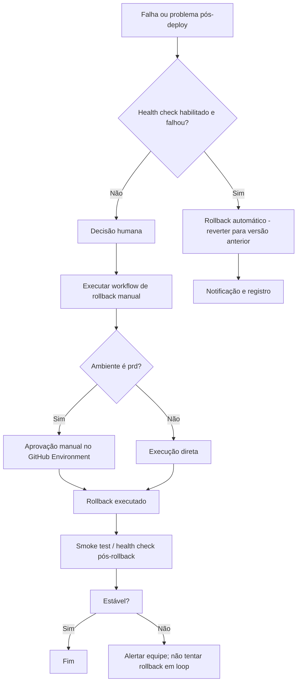

# Playbook de rollback

## Quando usar rollback automático vs manual

| Situação | Ação |
|----------|------|
| Health check pós-deploy falhou (quando habilitado no pipeline) | Rollback automático (futuro: job que reverte para versão anterior e notifica). |
| Problema detectado após deploy (erros, latência, bugs) | Rollback manual via workflow. |
| Necessidade de voltar para uma versão específica conhecida | Rollback manual com tag/SHA. |

## Diagrama de decisão

## Como executar o rollback manual

1. No repositório da **aplicação**, vá em **Actions** e selecione o workflow **Rollback ECS**. Exemplo de workflow: [example/.github/workflows/rollback.yml.example](../example/.github/workflows/rollback.yml.example) (copie para `.github/workflows/rollback.yml`).
2. Clique em **Run workflow**.
3. Preencha:
   - **environment**: dev | qa | sbx | prd
   - **deployment_name**: nome do deployment (ex.: `minha-api`)
   - **image_tag_or_sha**: tag ou SHA da imagem para a qual reverter (ex.: `abc1234` ou `20250130-143022`)
   - **reason**: motivo do rollback (para auditoria)
4. Para **prd**, o GitHub exibirá a fila de aprovação do environment; um reviewer deve aprovar.
5. Após a execução, verifique o **Summary** do run para o registro (ambiente, imagem, motivo, timestamp).

## Como consultar o histórico

- **Artifacts**: Em cada run de deploy, baixe o artifact `deploy-{env}-{deployment_name}-{run_id}` e abra `deploy.json` para ver a versão deployada (digest, tag, task_definition_arn, service_arn, commit, timestamp).
- **ECR**: No console AWS ECR, liste as imagens do repositório pela tag (sha ou timestamp) para confirmar a imagem disponível para rollback.
- O pipeline gera **nova task definition a cada deploy** (com a imagem do build); o rollback usa o mesmo padrão: registra uma nova revisão da task definition com a imagem desejada e atualiza o service.

## Falha pós-rollback

- Após o rollback, o workflow aguarda o service ECS estabilizar.
- Se o ambiente continuar instável:
  - Verifique logs (CloudWatch, ECS).
  - Não dispare rollback automático em loop; investigue a causa (ex.: task definition, variáveis, dependências).
  - Considere rollback para outra tag (versão anterior estável) ou correção de configuração.

## Proteções

- **prd**: Rollback em prd usa o environment `prd` com **Required reviewers**; aprovação manual é obrigatória.
- **Auditoria**: Motivo do rollback e dados do run ficam no Step Summary e no histórico do GitHub Actions.
