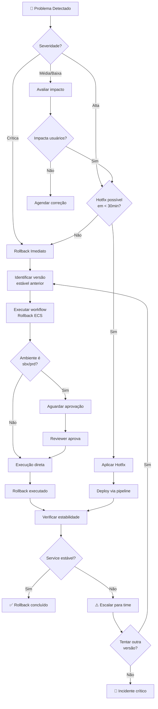

# 🔄 Playbook de Rollback

Guia completo para executar rollback de serviços ECS de forma segura e auditável.

---

## 📋 Índice

- [Quando Usar Rollback](#-quando-usar-rollback)
- [Como Funciona](#-como-funciona)
- [Passo a Passo](#-passo-a-passo)
- [Fluxograma de Decisão](#-fluxograma-de-decisão)
- [Consultar Histórico](#-consultar-histórico)
- [Pós-Rollback](#-pós-rollback)
- [Troubleshooting](#-troubleshooting)

---

## 🚨 Quando Usar Rollback

### Cenários para Rollback Imediato

| Severidade | Sintoma | Ação |
|------------|---------|------|
| 🔴 **Crítico** | Serviço fora do ar (500, timeout) | Rollback imediato |
| 🔴 **Crítico** | Perda de dados | Rollback imediato + investigação |
| 🟠 **Alto** | Funcionalidade quebrada | Rollback se não houver hotfix rápido |
| 🟡 **Médio** | Degradação de performance | Avaliar rollback vs hotfix |
| 🟢 **Baixo** | Bug cosmético | Não requer rollback |

### Checklist Antes do Rollback

- [ ] Confirmei o problema com logs/métricas
- [ ] Identifiquei a versão estável anterior
- [ ] Notifiquei o time
- [ ] (prd) Tenho aprovação necessária

---

## ⚙️ Como Funciona

### Mecânica do Rollback

O rollback **não** reverte task definitions antigas. Em vez disso:

1. Obtém a task definition **atual** do service
2. Troca apenas a **imagem** para a versão desejada
3. Registra uma **nova revisão** da task definition
4. Executa `update-service --force-new-deployment`

```
Task Definition Atual (rev 10)          Nova Task Definition (rev 11)
┌─────────────────────────────┐         ┌─────────────────────────────┐
│ image: app:abc1234 (bugada) │   →     │ image: app:xyz5678 (estável)│
│ env: VAR=value              │         │ env: VAR=value              │
│ secrets: arn:aws:...        │         │ secrets: arn:aws:...        │
│ cpu: 256                    │         │ cpu: 256                    │
│ memory: 512                 │         │ memory: 512                 │
└─────────────────────────────┘         └─────────────────────────────┘
```

### Por que assim?

- ✅ Preserva configurações atuais (secrets, env vars)
- ✅ Mantém integrações (Secrets Manager refs)
- ✅ Auditável (nova revisão = novo registro)
- ✅ Consistente com o pipeline de deploy

---

## 📝 Passo a Passo

### 1️⃣ Identificar a Versão Estável

**Opção A: Pelo Artifact de Deploy**

1. Vá em **Actions** no repositório
2. Encontre o último deploy bem-sucedido
3. Baixe o artifact `deploy-{env}-{service}-{run_id}`
4. Abra `deploy.json` e copie `image_tag`

```json
{
  "environment": "prd",
  "ecs_service": "minha-api",
  "image_tag": "xyz5678",  // ← Use esta tag
  "image_digest": "sha256:...",
  "timestamp": "2025-01-30T14:30:22Z"
}
```

**Opção B: Pelo ECR**

```bash
# Listar imagens recentes
aws ecr describe-images \
  --repository-name minha-api \
  --query 'imageDetails[*].[imageTags,imagePushedAt]' \
  --output table
```

### 2️⃣ Executar o Rollback

1. Vá em **Actions** no repositório
2. Selecione **Rollback ECS** (sidebar esquerda)
3. Clique em **Run workflow**
4. Preencha os campos:

| Campo | Exemplo | Descrição |
|-------|---------|-----------|
| `environment` | `prd` | Ambiente alvo |
| `ecs_service` | `minha-api` | Nome do service |
| `image_tag_or_sha` | `xyz5678` | Tag ou SHA da imagem estável |
| `reason` | `Bug crítico no endpoint /users` | Motivo (auditoria) |

5. Clique em **Run workflow**

### 3️⃣ Aprovar (se necessário)

Para **sbx** e **prd**:
- O workflow pausará aguardando aprovação
- Um reviewer receberá notificação
- Após aprovação, o rollback executa

### 4️⃣ Acompanhar Execução

- Monitore o workflow na aba Actions
- Verifique o Step Summary ao final
- Confirme que o service estabilizou

---

## 🔀 Fluxograma de Decisão



---

## 📊 Consultar Histórico

### Via GitHub Actions

```
Repository → Actions → Workflow runs → Selecionar run → Artifacts
```

### Via AWS CLI

```bash
# Ver revisões da task definition
aws ecs list-task-definitions \
  --family-prefix minha-api \
  --sort DESC \
  --max-items 10

# Ver deployments do service
aws ecs describe-services \
  --cluster meu-cluster \
  --services minha-api \
  --query 'services[0].deployments'

# Ver eventos recentes
aws ecs describe-services \
  --cluster meu-cluster \
  --services minha-api \
  --query 'services[0].events[:10]'
```

### Estrutura do Artifact

```
deploy-prd-minha-api-12345678/
└── deploy.json
    {
      "environment": "prd",
      "ecs_service": "minha-api",
      "image_digest": "sha256:abc123...",
      "image_tag": "xyz5678",
      "task_definition_arn": "arn:aws:ecs:...:task-definition/minha-api:42",
      "service_arn": "arn:aws:ecs:...:service/meu-cluster/minha-api",
      "commit_sha": "abc1234567890",
      "timestamp": "2025-01-30T14:30:22Z",
      "run_id": "12345678"
    }
```

---

## ✅ Pós-Rollback

### Checklist Imediato

- [ ] Service ECS estável (`aws ecs describe-services`)
- [ ] Health checks passando (ALB Target Group)
- [ ] Logs sem erros críticos (`aws logs tail`)
- [ ] Métricas normalizadas (CloudWatch)
- [ ] Funcionalidade validada (smoke test)

### Comunicação

```markdown
## 🔄 Rollback Executado

**Ambiente:** prd
**Service:** minha-api
**Versão anterior:** abc1234 (com bug)
**Versão atual:** xyz5678 (estável)
**Motivo:** [descrever]
**Timestamp:** 2025-01-30 14:45 UTC

**Status:** ✅ Service estabilizado
**Próximos passos:** [RCA, hotfix, etc]
```

### Próximos Passos

1. **RCA (Root Cause Analysis)** - Investigar causa do problema
2. **Hotfix** - Corrigir e fazer novo deploy quando pronto
3. **Post-mortem** - Documentar aprendizados

---

## 🔍 Troubleshooting

### Rollback Falhou

| Erro | Causa | Solução |
|------|-------|---------|
| `Image not found` | Tag não existe no ECR | Verificar tag correta |
| `Service not found` | Service name incorreto | Verificar nome exato |
| `Access Denied` | Permissões insuficientes | Verificar IAM policy |
| `Timeout waiting` | Tasks não estabilizam | Verificar logs das tasks |

### Service Não Estabiliza

```bash
# Ver eventos do service
aws ecs describe-services \
  --cluster CLUSTER \
  --services SERVICE \
  --query 'services[0].events[:5]'

# Ver logs das tasks
aws logs tail /ecs/SERVICE --follow

# Ver reason de tasks stopped
aws ecs describe-tasks \
  --cluster CLUSTER \
  --tasks TASK_ARN \
  --query 'tasks[0].stoppedReason'
```

### Rollback em Loop

⚠️ **NUNCA** tente rollback automático repetido. Se o segundo rollback também falhar:

1. **PARE** - Não faça mais rollbacks automáticos
2. **Investigue** - O problema pode não ser a imagem
3. **Considere**:
   - Task definition corrompida?
   - Secrets Manager indisponível?
   - Rede/VPC com problema?
   - Dependência externa down?

---

## 📚 Comandos Úteis

```bash
# Forçar novo deploy (sem mudar imagem)
aws ecs update-service \
  --cluster CLUSTER \
  --service SERVICE \
  --force-new-deployment

# Ver imagem atual
aws ecs describe-task-definition \
  --task-definition FAMILY \
  --query 'taskDefinition.containerDefinitions[0].image'

# Listar todas as tags de uma imagem
aws ecr describe-images \
  --repository-name REPO \
  --image-ids imageDigest=sha256:xxx \
  --query 'imageDetails[0].imageTags'

# Rollback manual via CLI
IMAGE="123456789.dkr.ecr.us-east-1.amazonaws.com/app:STABLE_TAG"
TASK_DEF=$(aws ecs describe-services --cluster C --services S --query 'services[0].taskDefinition' --output text)
TASK_JSON=$(aws ecs describe-task-definition --task-definition $TASK_DEF --query 'taskDefinition')
NEW_JSON=$(echo $TASK_JSON | jq --arg img "$IMAGE" 'del(.taskDefinitionArn,.revision,.status,.requiresAttributes,.compatibilities,.registeredAt,.registeredBy) | .containerDefinitions[0].image = $img')
NEW_ARN=$(aws ecs register-task-definition --cli-input-json "$NEW_JSON" --query 'taskDefinition.taskDefinitionArn' --output text)
aws ecs update-service --cluster C --service S --task-definition $NEW_ARN --force-new-deployment
```