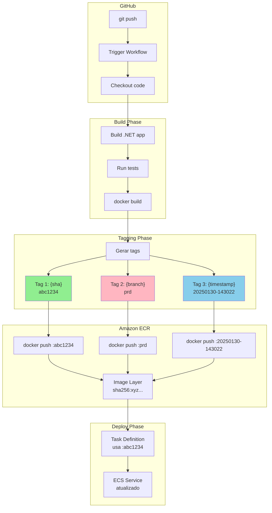

# 🏷️ Estratégia de Versionamento

Guia completo sobre tagging de imagens Docker e rastreabilidade de deploys.

---

## 📋 Índice

- [Como Funciona](#-como-funciona)
- [Tags Geradas](#-tags-geradas)
- [Fluxo de Tagging](#-fluxo-de-tagging)
- [Consultar Versões](#-consultar-versões)
- [Usar para Rollback](#-usar-para-rollback)
- [Boas Práticas](#-boas-práticas)

---

## ⚙️ Como Funciona

### Filosofia de Versionamento

O pipeline adota uma estratégia de **imutabilidade** baseada em:

| Princípio | Implementação | Benefício |
|-----------|---------------|-----------|
| **Rastreabilidade** | SHA do commit na tag | Liga imagem ↔ código |
| **Idempotência** | Mesmo commit = mesma imagem | Cache, reprodutibilidade |
| **Auditoria** | Timestamp UTC na tag | Linha do tempo de deploys |
| **Facilidade** | Tag por ambiente | Referência semântica |

### O Que Acontece no Build

```
Commit abc1234 na branch main
         │
         ▼
┌─────────────────────────────────────────────────────────────┐
│                        docker build                          │
│                             │                                │
│                             ▼                                │
│  123456789.dkr.ecr.us-east-1.amazonaws.com/minha-api:abc1234│
│  123456789.dkr.ecr.us-east-1.amazonaws.com/minha-api:prd    │
│  123456789.dkr.ecr.us-east-1.amazonaws.com/minha-api:20250130-143022│
└─────────────────────────────────────────────────────────────┘
         │
         ▼
    3 tags → mesma imagem (mesmo SHA256 digest)
```

---

## 🏷️ Tags Geradas

Cada push para o ECR gera **3 tags** apontando para a mesma imagem:

### 1. Tag SHA (Commit)

| Característica | Valor |
|----------------|-------|
| **Formato** | `{short_sha}` (7 caracteres) |
| **Exemplo** | `abc1234` |
| **Imutável** | ✅ Sim |
| **Uso principal** | Rollback, referência exata |

```yaml
# No workflow
env:
  IMAGE_TAG: ${{ github.sha | slice(0, 7) }}
```

### 2. Tag Branch/Ambiente

| Característica | Valor |
|----------------|-------|
| **Formato** | `{branch_name}` |
| **Exemplo** | `dev`, `qa`, `sbx`, `prd` |
| **Imutável** | ❌ Não (sobrescrita a cada deploy) |
| **Uso principal** | Referência por ambiente |

```yaml
# Uso na Task Definition (opcional)
"image": "123456789.dkr.ecr.us-east-1.amazonaws.com/app:prd"
# Cuidado: referência mutável!
```

### 3. Tag Timestamp

| Característica | Valor |
|----------------|-------|
| **Formato** | `YYYYMMDD-HHmmss` (UTC) |
| **Exemplo** | `20250130-143022` |
| **Imutável** | ✅ Sim |
| **Uso principal** | Auditoria, ordenação temporal |

```yaml
# Gerado no workflow
env:
  TIMESTAMP: $(date -u +%Y%m%d-%H%M%S)
```

---

## 🔄 Fluxo de Tagging



### Linha do Tempo de Releases

```
ECR Repository: minha-api
─────────────────────────────────────────────────────────────────────────
Tempo │ Tags                  │ Digest        │ Ambiente
─────────────────────────────────────────────────────────────────────────
T1    │ abc1234, 20250128-*   │ sha256:aaa... │ prd (antigo)
T2    │ def5678, 20250129-*   │ sha256:bbb... │ prd (antigo)
T3    │ ghi9012, prd, 20250130-* │ sha256:ccc │ prd (ATUAL) ← tag "prd" moveu
─────────────────────────────────────────────────────────────────────────
                                                │
Para rollback, usar abc1234 ou def5678        │
A tag "prd" sempre aponta para o deploy atual─┘
```

---

## 🔍 Consultar Versões

### Via Artifact de Deploy

Cada deploy bem-sucedido gera um artifact:

```
Actions → Workflow run → Artifacts
         │
         ▼
deploy-prd-minha-api-12345678.zip
         │
         ▼
deploy.json
{
  "environment": "prd",
  "ecs_service": "minha-api",
  "image_digest": "sha256:ccc123...",
  "image_tag": "ghi9012",
  "commit_sha": "ghi9012abc...",
  "branch": "main",
  "timestamp": "2025-01-30T14:30:22Z",
  "run_id": "12345678",
  "run_url": "https://github.com/.../actions/runs/12345678"
}
```

### Via AWS CLI

```bash
# Listar todas as imagens do repositório
aws ecr describe-images \
  --repository-name minha-api \
  --query 'imageDetails | sort_by(@, &imagePushedAt) | reverse(@)[:10]' \
  --output table

# Ver tags de uma imagem específica (por digest)
aws ecr describe-images \
  --repository-name minha-api \
  --image-ids imageDigest=sha256:xyz123 \
  --query 'imageDetails[0].imageTags'

# Ver qual imagem a tag "prd" aponta
aws ecr describe-images \
  --repository-name minha-api \
  --image-ids imageTag=prd \
  --query 'imageDetails[0].{Digest:imageDigest,Tags:imageTags,Pushed:imagePushedAt}'

# Buscar por padrão de timestamp
aws ecr describe-images \
  --repository-name minha-api \
  --query "imageDetails[?contains(imageTags, '20250130')]"
```

### Via AWS Console

```
ECR → Repositories → minha-api → Images
         │
         ▼
┌──────────────────────────────────────────────────────────────┐
│ Image tag     │ Pushed at           │ Size   │ Digest       │
├──────────────────────────────────────────────────────────────┤
│ ghi9012       │ 2025-01-30 14:30:22 │ 145 MB │ sha256:ccc...│
│ prd           │                     │        │              │
│ 20250130-*    │                     │        │              │
├──────────────────────────────────────────────────────────────┤
│ def5678       │ 2025-01-29 10:15:00 │ 145 MB │ sha256:bbb...│
│ 20250129-*    │                     │        │              │
└──────────────────────────────────────────────────────────────┘
```

---

## 🔄 Usar para Rollback

### Escolhendo a Tag Correta

| Cenário | Tag Recomendada | Exemplo |
|---------|-----------------|---------|
| Rollback para commit específico | SHA | `abc1234` |
| Rollback por horário | Timestamp | `20250129-101500` |
| Último deploy do ambiente | ⚠️ Branch | `prd` (não recomendado) |

### ⚠️ Por Que Não Usar Tag de Branch

```
Situação Perigosa:
─────────────────────────────────────────────────
1. Deploy quebrado com bug (tag "prd" → imagem bugada)
2. Você quer rollback
3. Usa workflow de rollback com tag "prd"
4. ❌ Rollback para a MESMA imagem bugada!
─────────────────────────────────────────────────

Sempre use TAG SHA ou TIMESTAMP para rollback!
```

### Workflow de Rollback

```yaml
# No workflow de rollback
inputs:
  image_tag_or_sha:
    description: 'Tag da imagem (SHA ou timestamp)'
    required: true
    # Exemplos válidos:
    # - abc1234 (SHA)
    # - 20250129-101500 (timestamp)
    # - sha256:abc123... (digest completo)
```

---

## ✅ Boas Práticas

### Lifecycle Policy (ECR)

Configure retenção automática para evitar acúmulo de imagens:

```json
{
  "rules": [
    {
      "rulePriority": 1,
      "description": "Manter últimas 30 imagens",
      "selection": {
        "tagStatus": "any",
        "countType": "imageCountMoreThan",
        "countNumber": 30
      },
      "action": {
        "type": "expire"
      }
    }
  ]
}
```

```bash
# Aplicar via CLI
aws ecr put-lifecycle-policy \
  --repository-name minha-api \
  --lifecycle-policy-text file://lifecycle-policy.json
```

### Convenções de Nomenclatura

| Elemento | Convenção | Exemplo |
|----------|-----------|---------|
| ECR Repository | Lowercase, hífens | `inbound-nfe-api` |
| Tag SHA | 7 caracteres | `abc1234` |
| Tag Timestamp | UTC, sem separadores | `20250130-143022` |
| Tag Branch | Nome da branch | `main`, `dev`, `prd` |

### Rastreabilidade Completa

```
Commit abc1234 ─────────────────────────────────────────────────────────▶
                 │
    ┌────────────┴────────────────────────────────────────────────────┐
    │                                                                  │
    │  GitHub Actions Run #12345678                                   │
    │  ├── Build job                                                  │
    │  │   └── Image: 123456789.dkr.ecr.../app:abc1234              │
    │  │                                                              │
    │  ├── Deploy job (prd)                                          │
    │  │   └── Task Definition: app:42                               │
    │  │   └── Service: app                                          │
    │  │                                                              │
    │  └── Artifact: deploy-prd-app-12345678                         │
    │       └── deploy.json (todos os metadados)                     │
    │                                                                  │
    └──────────────────────────────────────────────────────────────────┘
                 │
                 ▼
Rollback usando: abc1234 ou 20250130-143022
```

---

## 📚 Referência Rápida

```bash
# Ver imagem atual de um service
aws ecs describe-services --cluster C --services S \
  --query 'services[0].taskDefinition' --output text | \
  xargs aws ecs describe-task-definition --task-definition \
  --query 'taskDefinition.containerDefinitions[0].image'

# Encontrar qual commit gerou uma imagem
TAG="abc1234"
# O próprio tag é o SHA do commit!
git show $TAG --oneline

# Comparar duas versões
git diff abc1234..def5678 -- src/

# Ver todos os deploys de hoje
aws ecr describe-images --repository-name app \
  --query "imageDetails[?starts_with(to_string(imagePushedAt), '2025-01-30')]"
```