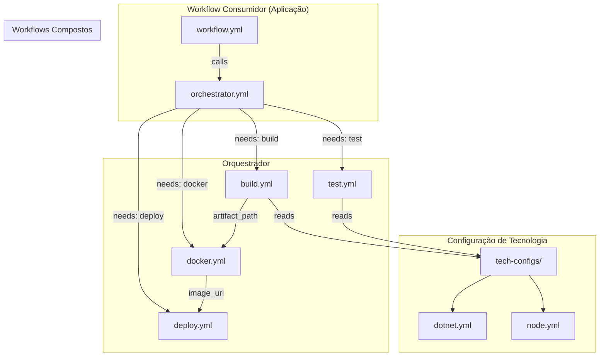
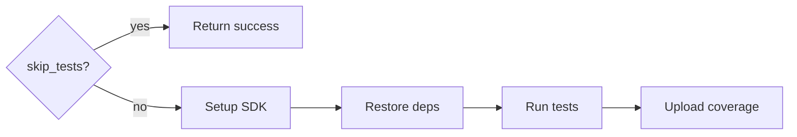
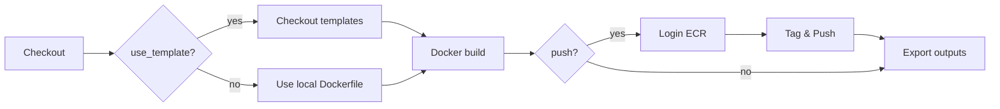
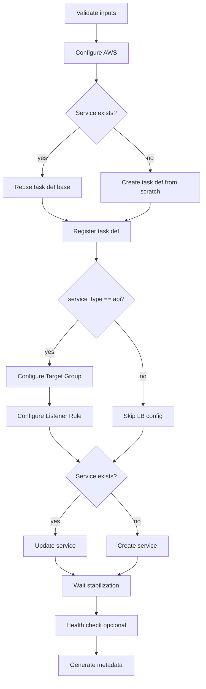
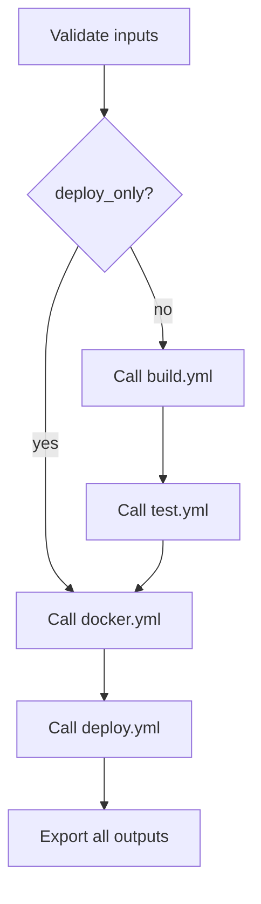

# Workflows Compostos - Design

**Spec**: `.specs/features/workflows-compostos/spec.md`  
**Status**: Implemented ✅

> **📚 Documentação de Consumo**: Para guias de uso e exemplos, consulte [COMPOSITES.md](../../.github/workflows/COMPOSITES.md)

> **⚠️ Nota de Implementação**: A estrutura final usa prefixo `composite-*.yml` na pasta `.github/workflows/` ao invés de subpasta `composites/` (veja AD-005 em STATE.md)

---

## Architecture Overview

Arquitetura baseada em composição de workflows reutilizáveis, onde cada fase do pipeline é um workflow isolado que pode ser chamado individualmente ou orquestrado.



---

## Code Reuse Analysis

### Existing Components to Leverage

| Component | Location | How to Use |
|-----------|----------|------------|
| Validação de ambiente | [reusable-ecs-pipeline.yml#L297-L304](../.github/workflows/reusable-ecs-pipeline.yml) | Extrair para action ou step reutilizável |
| Lógica de Task Definition | [reusable-ecs-pipeline.yml#L420-L512](../.github/workflows/reusable-ecs-pipeline.yml) | Incorporar no workflow de deploy |
| Target Group Config | [reusable-ecs-pipeline.yml#L515-L556](../.github/workflows/reusable-ecs-pipeline.yml) | Incorporar no workflow de deploy |
| Listener Rule Config | [reusable-ecs-pipeline.yml#L559-L610](../.github/workflows/reusable-ecs-pipeline.yml) | Incorporar no workflow de deploy |
| Service Create/Update | [reusable-ecs-pipeline.yml#L613-L698](../.github/workflows/reusable-ecs-pipeline.yml) | Incorporar no workflow de deploy |
| Deploy Metadata | [reusable-ecs-pipeline.yml#L712-L725](../.github/workflows/reusable-ecs-pipeline.yml) | Incorporar no workflow de deploy |
| Dockerfiles | `build/Dockerfile.api`, `build/Dockerfile.worker` | Manter como estão, referenciados pelo docker.yml |

### Integration Points

| System | Integration Method |
|--------|-------------------|
| GitHub Actions | Reusable workflows com `workflow_call` |
| AWS ECR | Login via `aws-actions/amazon-ecr-login@v2` |
| AWS ECS | Task def via `aws ecs register-task-definition` |
| Artefatos | Upload/download via `actions/upload-artifact@v4` |

---

## Components

### 1. Build Workflow (`composite-build.yml`)

- **Purpose**: Compilar código-fonte e gerar artefatos, agnóstico de tecnologia
- **Location**: `.github/workflows/composite-build.yml`
- **Interfaces**:
  - **Inputs**:
    - `technology: string` - Linguagem/framework (`dotnet` | `node`), default: `dotnet`
    - `technology_version: string` - Versão do SDK, default: baseado na tecnologia
    - `working_directory: string` - Diretório do código fonte, default: `src`
    - `project_name: string` - Nome do projeto (para .NET), opcional
    - `build_args: string` - Args adicionais de build, opcional
  - **Outputs**:
    - `artifact_path: string` - Caminho dos artefatos gerados
    - `artifact_name: string` - Nome do artifact para download
    - `build_success: boolean` - Indica se build completou com sucesso
- **Dependencies**: Nenhum workflow, apenas actions de setup
- **Reuses**: Lógica de cache do pipeline atual

**Fluxo interno**:


---

### 2. Test Workflow (`composite-test.yml`)

- **Purpose**: Executar testes automatizados e gerar relatórios de cobertura
- **Location**: `.github/workflows/composite-test.yml`
- **Interfaces**:
  - **Inputs**:
    - `technology: string` - Linguagem/framework, default: `dotnet`
    - `technology_version: string` - Versão do SDK
    - `working_directory: string` - Diretório do código fonte, default: `src`
    - `skip_tests: boolean` - Pular execução, default: `false`
    - `test_args: string` - Args adicionais de teste, opcional
  - **Outputs**:
    - `tests_passed: boolean` - Resultado dos testes
    - `coverage_report_path: string` - Caminho do relatório de cobertura (se disponível)
- **Dependencies**: Nenhum workflow (pode rodar independente)
- **Reuses**: Lógica de test do pipeline atual

**Fluxo interno**:


---

### 3. Docker Workflow (`composite-docker.yml`)

- **Purpose**: Construir imagem Docker e fazer push para ECR
- **Location**: `.github/workflows/composite-docker.yml`
- **Interfaces**:
  - **Inputs**:
    - `ecr_repo: string` - Nome do repositório ECR (required)
    - `service_type: string` - `api` | `worker` (required)
    - `push: boolean` - Fazer push para ECR, default: `true`
    - `dockerfile_path: string` - Caminho do Dockerfile, opcional
    - `use_template_dockerfile: boolean` - Usar Dockerfile do repo de templates, default: `true`
    - `templates_repo: string` - Repo dos templates
    - `templates_ref: string` - Branch/tag do repo de templates, default: `main`
    - `project_name: string` - Para build args do .NET
    - `aws_region: string` - Região AWS, default: `us-east-1`
    - `ecr_registry: string` - URL do registry ECR, opcional
    - `image_tags: string` - Tags adicionais (comma-separated), opcional
  - **Outputs**:
    - `image_digest: string` - Digest da imagem
    - `image_tag: string` - Tag principal (SHA)
    - `full_image_uri: string` - URI completa da imagem no ECR
    - `registry: string` - Registry ECR usado
  - **Secrets**:
    - `AWS_ACCESS_KEY_ID` (required)
    - `AWS_SECRET_ACCESS_KEY` (required)
    - `REPO_ACCESS_TOKEN` (optional, para templates)
- **Dependencies**: Artefatos do build (se necessário via `actions/download-artifact`)
- **Reuses**: Lógica de Docker build e ECR push do pipeline atual

**Fluxo interno**:


---

### 4. Deploy Workflow (`composite-deploy.yml`)

- **Purpose**: Fazer deploy de imagem no ECS Fargate
- **Location**: `.github/workflows/composite-deploy.yml`
- **Interfaces**:
  - **Inputs**:
    - `image_uri: string` - URI completa da imagem no ECR (required)
    - `ecs_service: string` - Nome do service ECS (required)
    - `environment: string` - Ambiente (dev|qa|sbx|prd) (required)
    - `service_type: string` - `api` | `worker` (required)
    - _+ todos os inputs de infraestrutura do pipeline atual_ (task config, network, load balancer, etc.)
  - **Outputs**:
    - `service_arn: string` - ARN do service ECS
    - `task_definition_arn: string` - ARN da task definition registrada
    - `deploy_metadata_artifact: string` - Nome do artifact com metadata
  - **Secrets**:
    - `AWS_ACCESS_KEY_ID` (required)
    - `AWS_SECRET_ACCESS_KEY` (required)
    - `ECS_CLUSTER` (optional)
    - `ECS_TASK_EXECUTION_ROLE_ARN` (optional)
- **Dependencies**: Imagem Docker no ECR
- **Reuses**: Toda a lógica de ECS do pipeline atual (task def, target group, listener, service)

**Fluxo interno**:


---

### 5. Orchestrator Workflow (`orchestrator.yml`)

- **Purpose**: Orquestrar workflows compostos mantendo compatibilidade com pipeline atual
- **Location**: `.github/workflows/orchestrator.yml`
- **Interfaces**:
  - **Inputs**: Todos os inputs do pipeline atual (`reusable-ecs-pipeline.yml`)
  - **Outputs**: Todos os outputs do pipeline atual
  - **Secrets**: Todos os secrets do pipeline atual
- **Dependencies**: Todos os workflows compostos
- **Reuses**: Apenas coordenação, delega toda lógica para compostos

**Fluxo interno**:


---

## Technology Configuration

Arquivos de configuração por tecnologia para extensibilidade.

### Location: `.github/tech-configs/`

### `dotnet.yml`
```yaml
name: dotnet
default_version: "8.0"
setup_action: actions/setup-dotnet@v4
cache:
  path: ~/.nuget/packages
  key_pattern: "${{ runner.os }}-nuget-${{ hashFiles('**/*.csproj') }}"
commands:
  restore: dotnet restore
  build: dotnet build --no-restore
  test: dotnet test --no-restore --verbosity normal
file_patterns:
  project: "**/*.csproj"
  solution: "**/*.sln"
```

### `node.yml`
```yaml
name: node
default_version: "20"
setup_action: actions/setup-node@v4
cache:
  path: ~/.npm
  key_pattern: "${{ runner.os }}-node-${{ hashFiles('**/package-lock.json') }}"
commands:
  restore: npm ci
  build: npm run build
  test: npm test
file_patterns:
  project: "**/package.json"
```

---

## Data Models

### Workflow Output Contract

Todos os workflows exportam metadados padronizados:

```typescript
interface WorkflowOutput {
  // Sempre presente
  status: 'success' | 'failure' | 'skipped';
  
  // Timing
  started_at?: string;      // ISO 8601
  completed_at?: string;    // ISO 8601
  duration_seconds?: number;
}

interface BuildOutput extends WorkflowOutput {
  artifact_path: string;
  artifact_name: string;
  build_success: boolean;
}

interface TestOutput extends WorkflowOutput {
  tests_passed: boolean;
  coverage_report_path?: string;
  test_count?: number;
  failed_count?: number;
}

interface DockerOutput extends WorkflowOutput {
  image_digest: string;
  image_tag: string;
  full_image_uri: string;
  registry: string;
}

interface DeployOutput extends WorkflowOutput {
  service_arn: string;
  task_definition_arn: string;
  deploy_metadata_artifact: string;
}
```

### Deploy Metadata (Artifact)

```typescript
interface DeployMetadata {
  environment: string;
  ecs_service: string;
  image_digest: string;
  image_tag: string;
  task_definition_arn: string;
  service_arn: string;
  commit_sha: string;
  timestamp: string;  // ISO 8601
  run_id: string;
}
```

---

## Error Handling Strategy

| Error Scenario | Handling | User Impact |
|----------------|----------|-------------|
| Build falha (compilation error) | Exit code != 0, `build_success: false` | Pipeline para, erro visível no log |
| Testes falham | Exit code != 0, `tests_passed: false` | Pipeline para (se não for skip_tests) |
| Dockerfile não encontrado | Fail fast com mensagem clara | "Dockerfile not found at: {path}" |
| Credenciais AWS inválidas | Fail fast no primeiro step AWS | "AWS credentials invalid or expired" |
| ECR repository não existe | Erro específico no push | "ECR repository '{name}' not found in region {region}" |
| ECS cluster não existe | Erro específico no deploy | "ECS cluster '{name}' not found" |
| Tecnologia desconhecida | Erro no build/test | "Unknown technology: {tech}. Supported: dotnet, node" |
| Service update timeout | Timeout no wait + mensagem | "Service failed to stabilize after 10m" |

---

## File Structure

```
.github/
├── workflows/
│   ├── composite-build.yml     # ~80 lines
│   ├── composite-test.yml      # ~60 lines
│   ├── composite-docker.yml    # ~100 lines
│   ├── composite-deploy.yml    # ~200 lines
│   ├── orchestrator.yml        # ~80 lines
│   ├── reusable-ecs-pipeline.yml  # (manter para retrocompatibilidade)
│   ├── rollback.yml
│   ├── test-composites.yml     # Testes de integração
│   └── COMPOSITES.md           # Documentação de consumo
└── actions/                    # Ações compostas auxiliares (se necessário)
    └── validate-inputs/
        └── action.yml
```

---

## Tech Decisions

| Decision | Choice | Rationale |
|----------|--------|-----------|
| Separação em 4 workflows | build, test, docker, deploy | Granularidade equilibrada - cada fase tem responsabilidade única e pode rodar independente |
| Usar `workflow_call` vs composite actions | `workflow_call` (reusable workflows) | Permite jobs separados com seus próprios runners, environments e secrets. Composite actions rodam no mesmo job. |
| Configuração de tecnologia em YAML | Arquivos em `.github/tech-configs/` | Extensível sem modificar workflows core. Adicionar Python = criar `python.yml` |
| Artefatos entre workflows | `actions/upload-artifact` + `actions/download-artifact` | Padrão GitHub Actions, zero dependência externa |
| Manter pipeline original | Wrapper que chama orchestrator | Zero breaking change - aplicações existentes não precisam mudar nada |
| Deploy inputs extensos | Manter todos os inputs atuais | Flexibilidade máxima para cenários existentes já configurados |

---

## Migration Strategy

### Fase 1: Implementação paralela
1. Criar workflows compostos em `.github/workflows/composites/`
2. Criar `orchestrator.yml` 
3. Testar com uma aplicação piloto

### Fase 2: Validação
1. Executar orchestrator em paralelo com pipeline atual
2. Comparar outputs e tempos de execução
3. Validar que resultados são idênticos

### Fase 3: Migração gradual
1. Modificar `reusable-ecs-pipeline.yml` para internamente chamar orchestrator
2. Aplicações existentes continuam funcionando sem alteração
3. Novas aplicações podem usar orchestrator diretamente

### Fase 4: Deprecação
1. Marcar `reusable-ecs-pipeline.yml` como deprecated
2. Documentar migração para orchestrator
3. Remover após período de transição (6 meses)

---

## Success Metrics

| Metric | Target | Measurement |
|--------|--------|-------------|
| Linhas por workflow composto | < 150 | `wc -l` |
| Linhas do orchestrator | < 100 | `wc -l` |
| Overhead de coordenação | < 10% tempo adicional | Comparar duração total vs pipeline atual |
| Configuração de nova app | < 50 linhas YAML | Contar linhas do workflow consumidor |
| Breaking changes | 0 | Aplicações existentes funcionam sem modificação |

---

## Tips

- **Validate early, fail fast** - Cada workflow valida seus inputs antes de executar
- **Outputs são contrato** - Mudanças em outputs quebram consumidores
- **Logs claros** - Cada step logou o que está fazendo com emoji de status
- **Idempotência** - Rodar o mesmo workflow 2x produz mesmo resultado
