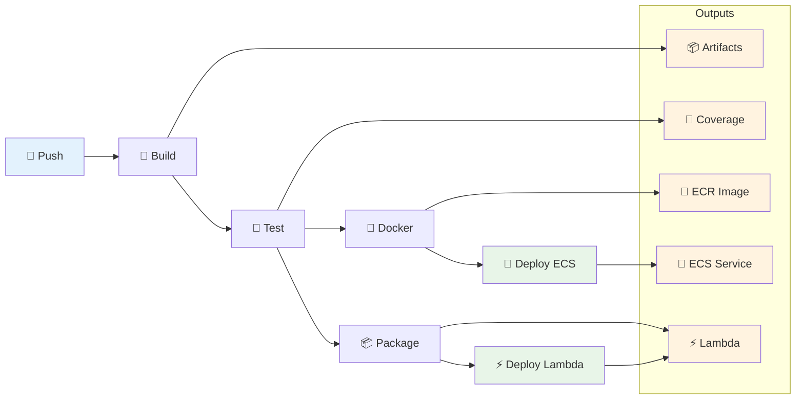

# Pipeline CI/CD Reutilizável

Pipeline CI/CD modular e agnóstico a tecnologia para AWS ECS Fargate com GitHub Actions.

## 🎯 Visão Geral

Este pipeline oferece uma solução completa de CI/CD composta por 4 workflows reutilizáveis que cobrem todo o ciclo desde build até deploy em produção. Suporta aplicações .NET e Node.js, com deploy automatizado em AWS ECS Fargate, Application Load Balancer para APIs e monitoramento via CloudWatch.

O design modular permite usar apenas os workflows necessários e adaptar facilmente para diferentes tecnologias e arquiteturas. Cada workflow é independente e pode ser customizado via inputs, mantendo as melhores práticas de segurança e escalabilidade.

## 📊 Fluxo Completo



## 🚀 Quick Start

### 1. Configure a organização (config de deploy + secrets)

Na **organização** GitHub (Organization Settings → Secrets and variables → Actions):

- **Variables**: crie uma variável por ambiente com um JSON contendo ECR, ECS, rede, load balancer: `DEV_CONFIG_DEPLOY`, `QA_CONFIG_DEPLOY`, `SBX_CONFIG_DEPLOY`, `PRD_CONFIG_DEPLOY`. Schema em [Organization Variables](docs/organization-variables.md).
- **Secrets**: por ambiente: `{ENV}_AWS_ACCESS_KEY_ID`, `{ENV}_AWS_SECRET_ACCESS_KEY`.

(Opcional) Para aprovações ou wait timers, crie **environments** no repositório (`Settings > Environments`): `dev`, `qa`, `sbx`, `prd`.

### 2. Crie seu workflow de deploy

Inclua um job `prepare` que resolve o ambiente (branch), lê `vars.{ENV}_CONFIG_DEPLOY`, faz parse com `jq` e grava os outputs; os jobs `docker` e `deploy` usam `needs.prepare.outputs.*`. Valores de deploy vêm da organização; use `environment: ${{ github.ref_name }}` apenas onde precisar de approval/proteção.

```yaml
name: Deploy

on:
  push:
    branches: [dev, qa, sbx, prd]

jobs:
  prepare:
    runs-on: ubuntu-latest
    # Resolve vars.{ENV}_CONFIG_DEPLOY + secrets e escreve ecr_registry, ecs_cluster, etc. nos outputs (ver deploy-env-pattern.md)

  build:
    needs: [prepare]
    uses: ./.github/workflows/composite-build.yml
    with:
      technology: dotnet
      working_directory: src

  test:
    uses: ./.github/workflows/composite-test.yml
    needs: build
    with:
      technology: dotnet

  docker:
    needs: [test, prepare]
    uses: ./.github/workflows/composite-docker.yml
    with:
      ecr_registry: ${{ needs.prepare.outputs.ecr_registry }}
      ecr_repo: minha-api
      service_type: api
      environment: ${{ github.ref_name }}
    secrets:
      AWS_ACCESS_KEY_ID: ${{ needs.prepare.outputs.aws_access_key }}
      AWS_SECRET_ACCESS_KEY: ${{ needs.prepare.outputs.aws_secret_key }}

  deploy:
    needs: [docker, prepare]
    uses: ./.github/workflows/composite-deploy.yml
    with:
      image_uri: ${{ needs.docker.outputs.full_image_uri }}
      ecs_service: minha-api-${{ github.ref_name }}
      ecs_cluster: ${{ needs.prepare.outputs.ecs_cluster }}
      environment: ${{ github.ref_name }}
      service_type: api
    secrets:
      AWS_ACCESS_KEY_ID: ${{ needs.prepare.outputs.aws_access_key }}
      AWS_SECRET_ACCESS_KEY: ${{ needs.prepare.outputs.aws_secret_key }}
```

## 📚 Workflows Disponíveis

| Workflow | Descrição | Tecnologias | Uso Principal |
|----------|-----------|-------------|---------------|
| 🔨 [`composite-build`](docs/workflows.md#composite-build) | Compilação multi-tecnologia com cache | .NET, Node.js | Build de aplicações |
| 🧪 [`composite-test`](docs/workflows.md#composite-test) | Execução de testes com cobertura | .NET, Node.js | Validação de qualidade |
| 🐳 [`composite-docker`](docs/workflows.md#composite-docker) | Build e push para ECR | Docker, AWS ECR | Criação de imagens |
| 🚀 [`composite-deploy`](docs/workflows.md#composite-deploy) | Deploy para ECS Fargate + ALB | AWS ECS, ALB | Deploy em produção |
| ⚡ [`composite-deploy-lambda`](docs/deploy-lambda.md) | Deploy para Lambda via ZIP/S3 | AWS Lambda | Funções serverless |

## 📖 Documentação Especializada

### 🔧 Configuração
- **[Guia de Migração de Serviços](docs/guia-migracao-servicos.md)**: Passo a passo GitLab→GitHub (import de todas as branches), criação de deploy.yml e migração por tipo (já ECS, ex-EKS, Lambda)
- **[Workflows](docs/workflows.md)**: Documentação técnica completa de todos os workflows
- **[Deploy Lambda](docs/deploy-lambda.md)**: Deploy idempotente de AWS Lambda via ZIP/S3
- **[Organization Variables](docs/organization-variables.md)**: Variável JSON de config de deploy por ambiente e secrets na organização
- **[Environments](docs/environments.md)**: Modelo recomendado (config na org) e uso de environments no repositório para aprovações
- **[Diagramas](docs/diagramas.md)**: Visualizações dos fluxos e arquitetura

## ✨ Características

### 🏗️ **Arquitetura Modular**
- Workflows compostos independentes
- Reutilização entre projetos
- Customização via inputs

### 🌐 **Multi-tecnologia**
- .NET Core/Framework
- Node.js
- Extensível para outras tecnologias

### ☁️ **AWS Native**
- ECR para registry de imagens
- ECS Fargate para compute
- ALB para load balancing
- CloudWatch para logs

### 🔒 **Segurança & Compliance**
- Validação automática de inputs
- Secrets management
- Environments com aprovações
- Least privilege principle

### 📊 **Observabilidade**
- Logs estruturados
- Métricas de deployment
- Health checks automáticos
- Artifacts de debug

## 🎯 Casos de Uso Suportados

### 📱 **APIs RESTful**
- Deploy com Application Load Balancer
- Health checks automáticos
- SSL/TLS termination
- Auto-scaling baseado em métricas

### ⚙️ **Workers/Background Services**
- Processamento assíncrono
- Queue processing
- Scheduled tasks
- Resource optimization

### 🔄 **Aplicações Full-Stack**
- Frontend + API
- Microservices
- Event-driven architecture

## 🛠️ Tecnologias Suportadas

### Atualmente Suportadas
- **.NET**: 6.0, 7.0, 8.0+
- **Node.js**: 18, 20, LTS

### Adicionando Nova Tecnologia

1. Crie arquivo em `.github/tech-configs/{tecnologia}.yml`
2. Atualize workflows `composite-build.yml` e `composite-test.yml`
3. Adicione validação em `.github/actions/validate-inputs/`
4. Documente e teste

### Reportando Issues

- Use o template apropriado
- Inclua logs relevantes
- Descreva ambiente (AWS, GitHub, tecnologia)

---

💡 **Dica**: Comece com o [Guia de Adaptação](docs/adaptacao.md) para implementar em seu projeto específico.