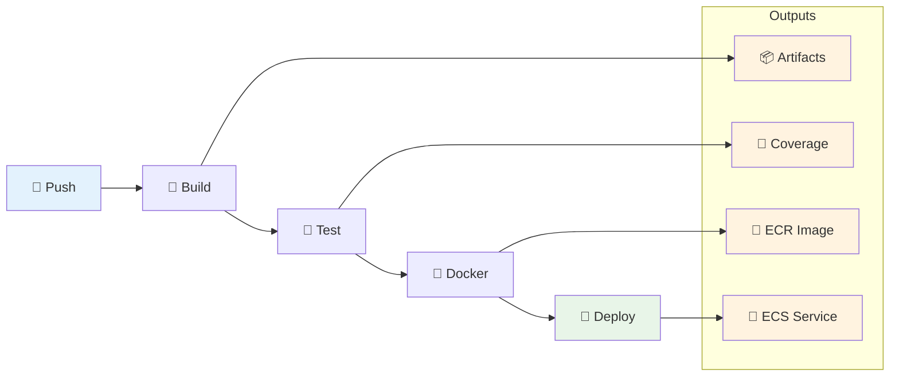

# Pipeline CI/CD Reutilizável

Pipeline CI/CD modular e agnóstico a tecnologia para AWS ECS Fargate com GitHub Actions.

## 🎯 Visão Geral

Este pipeline oferece uma solução completa de CI/CD composta por 4 workflows reutilizáveis que cobrem todo o ciclo desde build até deploy em produção. Suporta aplicações .NET e Node.js, com deploy automatizado em AWS ECS Fargate, Application Load Balancer para APIs e monitoramento via CloudWatch.

O design modular permite usar apenas os workflows necessários e adaptar facilmente para diferentes tecnologias e arquiteturas. Cada workflow é independente e pode ser customizado via inputs, mantendo as melhores práticas de segurança e escalabilidade.

## 📊 Fluxo Completo



## 🚀 Quick Start

### 1. Adicione os workflows ao seu projeto

```bash
# Copie os workflows para .github/workflows/
cp -r infra-ci-cd/.github/workflows/ .github/
cp -r infra-ci-cd/.github/actions/ .github/
cp -r infra-ci-cd/.github/tech-configs/ .github/
```

### 2. Configure os environments no GitHub

Acesse `Settings > Environments` e crie: `dev`, `qa`, `sbx`, `prd`

### 3. Configure variáveis e secrets

Defina em cada environment:
- `ECR_REGISTRY`, `ECS_CLUSTER`, `SUBNET_IDS` etc.
- Secrets: `AWS_ACCESS_KEY_ID`, `AWS_SECRET_ACCESS_KEY`

### 4. Crie seu workflow de deploy

```yaml
name: Deploy

on:
  push:
    branches: [develop, qa, main]

jobs:
  build:
    uses: ./.github/workflows/composite-build.yml
    with:
      technology: dotnet
      working_directory: src

  test:
    uses: ./.github/workflows/composite-test.yml
    with:
      technology: dotnet
    needs: build

  docker:
    uses: ./.github/workflows/composite-docker.yml
    with:
      ecr_repo: minha-api
      service_type: api
      environment: ${{ github.ref_name }}
    secrets: inherit
    needs: [build, test]

  deploy:
    uses: ./.github/workflows/composite-deploy.yml
    with:
      image_uri: ${{ needs.docker.outputs.full_image_uri }}
      ecs_service: minha-api-${{ github.ref_name }}
      environment: ${{ github.ref_name }}
      service_type: api
    secrets: inherit
    needs: docker
    environment: ${{ github.ref_name }}
```

## 📚 Workflows Disponíveis

| Workflow | Descrição | Tecnologias | Uso Principal |
|----------|-----------|-------------|---------------|
| 🔨 [`composite-build`](docs/workflows.md#composite-build) | Compilação multi-tecnologia com cache | .NET, Node.js | Build de aplicações |
| 🧪 [`composite-test`](docs/workflows.md#composite-test) | Execução de testes com cobertura | .NET, Node.js | Validação de qualidade |
| 🐳 [`composite-docker`](docs/workflows.md#composite-docker) | Build e push para ECR | Docker, AWS ECR | Criação de imagens |
| 🚀 [`composite-deploy`](docs/workflows.md#composite-deploy) | Deploy para ECS Fargate + ALB | AWS ECS, ALB | Deploy em produção |

## 📖 Documentação Especializada

### 🔧 Configuração
- **[Workflows](docs/workflows.md)**: Documentação técnica completa de todos os workflows
- **[Environments](docs/environments.md)**: Configuração de environments, variáveis e secrets
- **[Diagramas](docs/diagramas.md)**: Visualizações dos fluxos e arquitetura

### 🎯 Implementação
- **[Guia de Adaptação](docs/adaptacao.md)**: Como adaptar o pipeline para seu projeto

## ✨ Características

### 🏗️ **Arquitetura Modular**
- Workflows compostos independentes
- Reutilização entre projetos
- Customização via inputs

### 🌐 **Multi-tecnologia**
- .NET Core/Framework
- Node.js
- Extensível para outras tecnologias

### ☁️ **AWS Native**
- ECR para registry de imagens
- ECS Fargate para compute
- ALB para load balancing
- CloudWatch para logs

### 🔒 **Segurança & Compliance**
- Validação automática de inputs
- Secrets management
- Environments com aprovações
- Least privilege principle

### 📊 **Observabilidade**
- Logs estruturados
- Métricas de deployment
- Health checks automáticos
- Artifacts de debug

## 🎯 Casos de Uso Suportados

### 📱 **APIs RESTful**
- Deploy com Application Load Balancer
- Health checks automáticos
- SSL/TLS termination
- Auto-scaling baseado em métricas

### ⚙️ **Workers/Background Services**
- Processamento assíncrono
- Queue processing
- Scheduled tasks
- Resource optimization

### 🔄 **Aplicações Full-Stack**
- Frontend + API
- Microservices
- Event-driven architecture

## 🛠️ Tecnologias Suportadas

### Atualmente Suportadas
- **.NET**: 6.0, 7.0, 8.0+
- **Node.js**: 18, 20, LTS

## 🤝 Contribuição

Contribuições são bem-vindas! Veja nosso [exemplo de uso](../exemplo-uso-pipeline/) para referência de implementação.

### Adicionando Nova Tecnologia

1. Crie arquivo em `.github/tech-configs/{tecnologia}.yml`
2. Atualize workflows `composite-build.yml` e `composite-test.yml`
3. Adicione validação em `.github/actions/validate-inputs/`
4. Documente e teste

### Reportando Issues

- Use o template apropriado
- Inclua logs relevantes
- Descreva ambiente (AWS, GitHub, tecnologia)

---

💡 **Dica**: Comece com o [Guia de Adaptação](docs/adaptacao.md) para implementar em seu projeto específico.