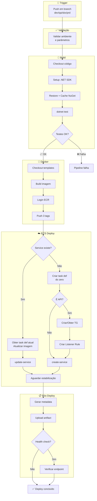
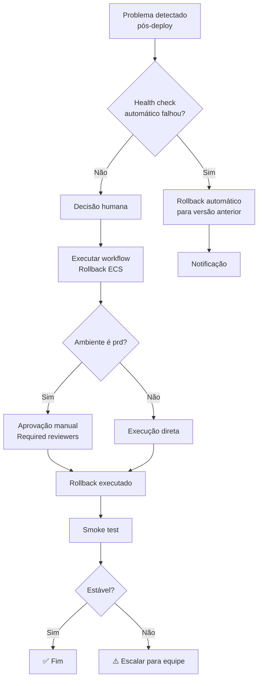

# 🚀 CI/CD para AWS ECS com GitHub Actions

Pipeline reutilizável e completo para deploy de aplicações **.NET** (APIs e Workers) no **Amazon ECS Fargate**.

[](https://docs.github.com/en/actions/using-workflows/reusing-workflows)
[](https://aws.amazon.com/ecs/)
[](https://dotnet.microsoft.com/)

---

## 📋 Índice

- [Visão Geral](#-visão-geral)
- [Como Funciona](#-como-funciona)
- [Arquitetura e Fluxograma](#-arquitetura-e-fluxograma)
- [Estrutura do Projeto](#-estrutura-do-projeto)
- [Guia de Configuração](#-guia-de-configuração)
- [Referência de Inputs](#-referência-de-inputs)
- [Exemplos de Uso](#-exemplos-de-uso)
- [Rollback](#-rollback)
- [Troubleshooting](#-troubleshooting)

---

## 🎯 Visão Geral

### O que é?

Um **workflow reutilizável** do GitHub Actions que automatiza todo o ciclo de vida de deploy de aplicações .NET no AWS ECS:

```
Build → Test → Docker → ECR → ECS (Task Definition + Service)
```

### Características Principais

| Recurso | Descrição |
|---------|-----------|
| 🔄 **Reutilizável** | Um único workflow para todas as aplicações |
| 🏗️ **Greenfield & Brownfield** | Cria serviços do zero ou atualiza existentes |
| 🔐 **Zero Secrets em Plain Text** | Uso exclusivo de GitHub Environments |
| 🌍 **Multi-ambiente** | dev, qa, sbx, prd com isolamento de credenciais |
| ⚡ **FARGATE_SPOT** | Suporte a capacity providers para economia |
| 🔁 **Rollback** | Workflow dedicado com aprovação em produção |
| 🎯 **Idempotente** | Target Groups e Listeners criados apenas se não existirem |

### Cenários Suportados

| Cenário | Descrição | Exemplo |
|---------|-----------|---------|
| **Greenfield (API)** | Service + Task Definition + Target Group + Listener do zero | Nova API REST |
| **Greenfield (Worker)** | Service + Task Definition do zero | Novo processador de filas |
| **Brownfield** | Atualiza apenas a imagem (task definition existente preservada) | Deploy de correção |

---

## ⚙️ Como Funciona

### Conceitos Principais

#### Nomenclatura

| Parâmetro | Descrição | Exemplo |
|-----------|-----------|---------|
| `ecs_service` | Nome do Service ECS **e** Task Definition Family | `inbound-nfe-api-envioxml` |
| `ecr_repo` | Nome do repositório no ECR | `inbound` |
| `ecr_registry` | URL do registry ECR | `123456789.dkr.ecr.us-east-1.amazonaws.com` |

**Imagem final:** `{ecr_registry}/{ecr_repo}:{tag}` → `123456789.dkr.ecr.us-east-1.amazonaws.com/inbound:abc1234`

#### Dockerfile

| Modo | Quando Usar | Configuração |
|------|-------------|--------------|
| **Padrão** | Projetos .NET padrão | `use_default_dockerfile: true` + `templates_repo` + `project_name` |
| **Customizado** | Dockerfile próprio | `use_default_dockerfile: false` + `dockerfile_path` |

#### Mapeamento Branch → Ambiente

| Branch | Environment | Aprovação | Uso |
|--------|-------------|-----------|-----|
| `dev` | `dev` | ❌ Não | Desenvolvimento |
| `qa` | `qa` | ❌ Não | Testes |
| `sbx` | `sbx` | ✅ Sim | Homologação |
| `prd` | `prd` | ✅ Sim | Produção |

### Fluxo de Execução Detalhado

#### 1️⃣ Build & Test
```
dotnet restore → dotnet test → docker build
```
- Cache de pacotes NuGet para performance
- Falha nos testes interrompe o pipeline

#### 2️⃣ Push ECR
```
docker tag → docker push (3 tags)
```
| Tag | Exemplo | Finalidade |
|-----|---------|------------|
| SHA | `abc1234` | Rollback preciso |
| Branch | `prd` | Referência por ambiente |
| Timestamp | `20250131-143022` | Auditoria |

#### 3️⃣ Deploy ECS

**Service Existe (Brownfield):**
1. Obtém task definition atual do service
2. Atualiza apenas a imagem (preserva secrets, env vars, etc.)
3. Registra nova revisão
4. `update-service --force-new-deployment`

**Service Não Existe (Greenfield):**
1. Cria task definition completa a partir dos inputs
2. (API) Cria/obtém Target Group e Listener Rule
3. `create-service` com rede, LB, capacity provider
4. Aguarda estabilização

#### 4️⃣ Pós-Deploy
- Gera artifact `deploy.json` com metadados
- (Opcional) Health check HTTP

---

## 🏗️ Arquitetura e Fluxograma

### Diagrama de Componentes

```
┌─────────────────────────────────────────────────────────────────────────────┐
│                            GITHUB ACTIONS                                    │
│  ┌─────────────────────────────────────────────────────────────────────┐    │
│  │                    reusable-ecs-pipeline.yml                         │    │
│  │  ┌──────────┐  ┌──────────┐  ┌──────────┐  ┌──────────┐  ┌────────┐│    │
│  │  │ Validate │→ │  Build   │→ │  Test    │→ │  Docker  │→ │  Push  ││    │
│  │  └──────────┘  └──────────┘  └──────────┘  └──────────┘  └────────┘│    │
│  │       ↓                                                       ↓      │    │
│  │  ┌──────────┐  ┌──────────┐  ┌──────────┐  ┌──────────┐  ┌────────┐│    │
│  │  │ Task Def │→ │ Target   │→ │ Listener │→ │   ECS    │→ │ Health ││    │
│  │  │ Register │  │  Group   │  │   Rule   │  │  Deploy  │  │ Check  ││    │
│  │  └──────────┘  └──────────┘  └──────────┘  └──────────┘  └────────┘│    │
│  └─────────────────────────────────────────────────────────────────────┘    │
└─────────────────────────────────────────────────────────────────────────────┘
                                      │
                                      ▼
┌─────────────────────────────────────────────────────────────────────────────┐
│                                  AWS                                         │
│  ┌─────────────┐    ┌─────────────┐    ┌─────────────────────────────────┐  │
│  │     ECR     │    │     ALB     │    │            ECS                   │  │
│  │  ┌───────┐  │    │  ┌───────┐  │    │  ┌─────────┐    ┌────────────┐  │  │
│  │  │ Image │  │    │  │Listener│ │    │  │ Cluster │    │  Service   │  │  │
│  │  │ :sha  │  │    │  │ Rules │  │    │  │         │    │  ┌──────┐  │  │  │
│  │  │ :env  │  │    │  └───┬───┘  │    │  │         │    │  │ Task │  │  │  │
│  │  │ :time │  │    │      │      │    │  │         │    │  │ Def  │  │  │  │
│  │  └───────┘  │    │  ┌───▼───┐  │    │  │         │    │  └──────┘  │  │  │
│  └─────────────┘    │  │Target │  │    │  │         │    │      │     │  │  │
│                     │  │ Group │──┼────┼──┼─────────┼────┼──────▼─────│  │  │
│                     │  └───────┘  │    │  │         │    │  ┌──────┐  │  │  │
│                     └─────────────┘    │  │         │    │  │ Task │  │  │  │
│                                        │  └─────────┘    │  └──────┘  │  │  │
│                                        └─────────────────────────────────┘  │
└─────────────────────────────────────────────────────────────────────────────┘
```

### Fluxograma do Pipeline



### Fluxograma do Rollback



---

## 📁 Estrutura do Projeto

```
infra-ci-cd/
├── 📄 README.md                          # Esta documentação
├── 📁 .github/
│   ├── 📁 workflows/
│   │   ├── 📄 reusable-ecs-pipeline.yml  # 🎯 Pipeline principal
│   │   └── 📄 rollback.yml               # 🔄 Rollback manual
│   ├── 📄 ENVIRONMENTS.md                # 📝 Guia de environments
│   ├── 📄 VERSIONING.md                  # 📝 Estratégia de tags
│   └── 📄 ROLLBACK-PLAYBOOK.md           # 📝 Playbook de rollback
├── 📁 build/
│   ├── 📄 README.md                      # 📝 Doc dos Dockerfiles
│   ├── 🐳 Dockerfile.api                 # Dockerfile para APIs
│   └── 🐳 Dockerfile.worker              # Dockerfile para Workers
```

---

## 🔧 Guia de Configuração

### Passo 1: Configurar GitHub Environments

Na organização ou repositório da aplicação, vá em **Settings > Environments** e crie:

| Environment | Configuração |
|-------------|--------------|
| `dev` | Deployment branches: `dev` |
| `qa` | Deployment branches: `qa` |
| `sbx` | Deployment branches: `sbx` + **Required reviewers** |
| `prd` | Deployment branches: `prd` + **Required reviewers** |

### Passo 2: Configurar Variables (por ambiente)

| Variable | Obrigatório | Descrição |
|----------|-------------|-----------|
| `ECR_REGISTRY` | ✅ | URL do ECR (ex: `123456789.dkr.ecr.us-east-1.amazonaws.com`) |
| `LOAD_BALANCER_NAME` | API | Nome do ALB existente |
| `ECS_CLUSTER` | ✅ | Nome do cluster ECS |
| `SUBNET_IDS` | 1º deploy | IDs das subnets (vírgula) |
| `SECURITY_GROUP_IDS` | 1º deploy | IDs dos security groups (vírgula) |
| `ECS_TASK_EXECUTION_ROLE_ARN` | ✅ | ARN da role de execução |
| `ECS_TASK_ROLE_ARN` | ✅ | ARN da role de execução |

### Passo 3: Configurar Secrets (por ambiente)

| Secret | Obrigatório | Descrição |
|--------|-------------|-----------|
| `AWS_ACCESS_KEY_ID` | ✅ | Access Key AWS |
| `AWS_SECRET_ACCESS_KEY` | ✅ | Secret Key AWS |

### Passo 4: Criar Workflow na Aplicação

Crie `.github/workflows/deploy.yml`:

```yaml
name: Deploy

on:
  push:
    branches: [dev, qa, sbx, prd]

jobs:
  deploy:
    uses: SEU_ORG/infra-ci-cd/.github/workflows/reusable-ecs-pipeline.yml@main
    with:
      ecs_service: minha-api
      service_type: api
      ecr_repo: minha-api
      ecr_registry: ${{ vars.ECR_REGISTRY }}
      environment: ${{ github.ref_name }}
      # ... outros inputs
    secrets: inherit
```

📚 **Exemplos completos:** [example/](example/)

---

## 📖 Referência de Inputs

### Inputs Obrigatórios

| Input | Tipo | Descrição |
|-------|------|-----------|
| `ecs_service` | string | Nome do Service ECS e Task Definition Family |
| `service_type` | string | `api` ou `worker` |
| `ecr_repo` | string | Nome do repositório ECR |
| `environment` | string | `dev`, `qa`, `sbx` ou `prd` |

### Build & Docker

| Input | Padrão | Descrição |
|-------|--------|-----------|
| `dotnet_version` | `8.0` | Versão do .NET SDK |
| `working_directory` | `src` | Diretório do código fonte |
| `use_default_dockerfile` | `true` | Usar Dockerfile do repo de templates |
| `templates_repo` | - | Repo dos templates (quando use_default=true) |
| `project_name` | - | Nome do .csproj (quando use_default=true) |
| `dockerfile_path` | - | Caminho do Dockerfile (quando use_default=false) |

### ECS - Task Definition

| Input | Padrão | Descrição |
|-------|--------|-----------|
| `task_cpu` | `256` | CPU (256, 512, 1024, 2048, 4096) |
| `task_memory` | `512` | Memória em MB |
| `container_name` | `app` | Nome do container |
| `container_port` | `80` | Porta do container |
| `container_environment` | - | JSON array de env vars |
| `container_secrets` | - | JSON array de secrets (Secrets Manager) |
| `runtime_cpu_architecture` | - | `X86_64` ou `ARM64` |
| `runtime_os_family` | - | `LINUX` ou `WINDOWS_SERVER_2019_CORE` |

### ECS - Service

| Input | Padrão | Descrição |
|-------|--------|-----------|
| `desired_count` | `1` | Número de tasks |
| `subnet_ids` | - | IDs das subnets (vírgula) |
| `security_group_ids` | - | IDs dos SGs (vírgula) |
| `capacity_provider_strategy` | - | Ex: `FARGATE_SPOT:0:4` |
| `platform_version` | - | Ex: `1.4.0` |
| `enable_execute_command` | `false` | Habilitar ECS Exec |
| `enable_zone_rebalancing` | `false` | Rebalanceamento de AZs |
| `deployment_circuit_breaker_enable` | `false` | Circuit breaker |
| `deployment_circuit_breaker_rollback` | `false` | Auto-rollback |

### API - Load Balancer

| Input | Padrão | Descrição |
|-------|--------|-----------|
| `create_target_group_and_listener` | `false` | Criar/obter TG e Listener |
| `load_balancer_name` | - | Nome do ALB |
| `target_group_name` | - | Nome do Target Group |
| `target_group_port` | `80` | Porta do TG |
| `target_group_health_check_path` | `/` | Path do health check |
| `listener_port` | `80` | Porta do Listener |
| `listener_rule_host_header` | - | Host header para routing |
| `listener_rule_path_pattern` | - | Path pattern para routing |

---

## 💡 Exemplos de Uso

### API Greenfield (Todos os Inputs)

```yaml
uses: SEU_ORG/infra-ci-cd/.github/workflows/reusable-ecs-pipeline.yml@main
with:
  ecs_service: minha-nova-api
  service_type: api
  ecr_repo: minha-nova-api
  ecr_registry: ${{ vars.ECR_REGISTRY }}
  environment: ${{ github.ref_name }}
  
  # Build
  use_default_dockerfile: true
  templates_repo: SEU_ORG/infra-ci-cd
  project_name: MinhaApi
  
  # ECS
  ecs_cluster: ${{ vars.ECS_CLUSTER }}
  ecs_task_execution_role_arn: ${{ vars.ECS_TASK_EXECUTION_ROLE_ARN }}
  subnet_ids: ${{ vars.ECS_SUBNET_IDS }}
  security_group_ids: ${{ vars.ECS_SECURITY_GROUP_IDS }}
  
  # Load Balancer
  create_target_group_and_listener: true
  load_balancer_name: ${{ vars.ALB_NAME }}
  target_group_name: tg-minha-api-${{ github.ref_name }}
  listener_rule_host_header: 'api.${{ github.ref_name }}.example.com'
  listener_rule_path_pattern: '/api/v1/*'
  
  # Fargate Spot
  capacity_provider_strategy: FARGATE_SPOT:0:4
secrets: inherit
```

### Worker Brownfield (Mínimo)

```yaml
uses: SEU_ORG/infra-ci-cd/.github/workflows/reusable-ecs-pipeline.yml@main
with:
  ecs_service: meu-worker-existente
  service_type: worker
  ecr_repo: meu-worker
  ecr_registry: ${{ vars.ECR_REGISTRY }}
  environment: ${{ github.ref_name }}
  use_default_dockerfile: true
  templates_repo: SEU_ORG/infra-ci-cd
  project_name: MeuWorker
secrets: inherit
```

---

## 🔄 Rollback

### Como Executar

1. Vá em **Actions** no repositório
2. Selecione **Rollback ECS**
3. Clique em **Run workflow**
4. Preencha:
   - `environment`: dev, qa, sbx ou prd
   - `ecs_service`: nome do service
   - `image_tag_or_sha`: tag para rollback (ex: `abc1234`)
   - `reason`: motivo (auditoria)

### Aprovação

- **sbx/prd**: Requer aprovação de reviewer
- **dev/qa**: Execução direta

📚 **Playbook completo:** [ROLLBACK-PLAYBOOK.md](.github/ROLLBACK-PLAYBOOK.md)

---

## 🔍 Troubleshooting

### Problemas Comuns

| Problema | Causa | Solução |
|----------|-------|---------|
| `NETSDK1064` no build | `.dockerignore` faltando | Adicione `**/obj/` e `**/bin/` |
| Service não atualiza | Task definition igual | Verifique se a imagem mudou |
| Target Group já existe | Nome duplicado | Use nome único por ambiente |
| Listener Rule conflita | Prioridade duplicada | Deixe vazio para auto-incrementar |

### Comandos Úteis

```bash
# Ver status do service
aws ecs describe-services --cluster CLUSTER --services SERVICE

# Ver logs em tempo real
aws logs tail /ecs/SERVICE --follow

# Forçar novo deploy
aws ecs update-service --cluster CLUSTER --service SERVICE --force-new-deployment

# Listar imagens no ECR
aws ecr describe-images --repository-name REPO --query 'imageDetails[*].[imageTags,imagePushedAt]'
```

---

## 📚 Documentação Adicional

| Documento | Descrição |
|-----------|-----------|
| [ENVIRONMENTS.md](.github/ENVIRONMENTS.md) | Configuração de environments e secrets |
| [VERSIONING.md](.github/VERSIONING.md) | Estratégia de tags e histórico |
| [ROLLBACK-PLAYBOOK.md](.github/ROLLBACK-PLAYBOOK.md) | Guia completo de rollback |
| [build/README.md](build/README.md) | Documentação dos Dockerfiles |
| [example/README.md](example/README.md) | Guia dos projetos de exemplo |

---

## 📄 Licença

Este projeto é interno e proprietário.