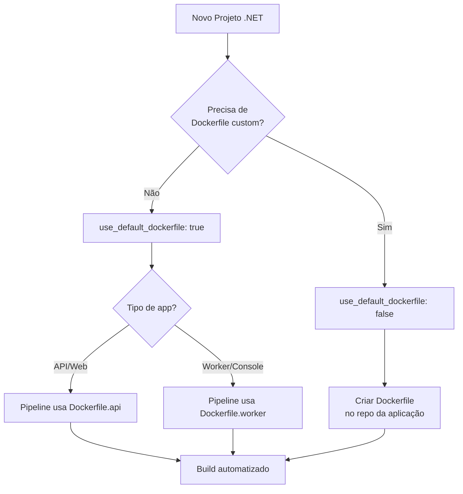
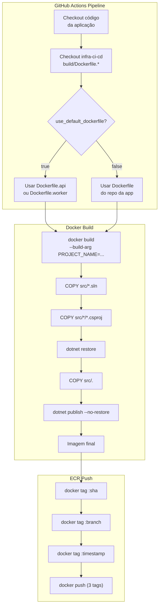

# 🐳 Dockerfiles Padrão

Templates de Dockerfile para aplicações .NET usados pelo pipeline CI/CD.

---

## 📋 Índice

- [Visão Geral](#-visão-geral)
- [Dockerfile.api](#-dockerfileapi)
- [Dockerfile.worker](#-dockerfileworker)
- [Como Funciona o Build](#-como-funciona-o-build)
- [Requisitos do Projeto](#-requisitos-do-projeto)
- [Configuração](#-configuração)
- [Troubleshooting](#-troubleshooting)

---

## 🎯 Visão Geral

Esta pasta contém Dockerfiles genéricos usados pelo pipeline quando a aplicação define `use_default_dockerfile: true`.

| Dockerfile | Uso | Base Image |
|------------|-----|------------|
| `Dockerfile.api` | APIs ASP.NET Core | `dotnet/aspnet:7.0` |
| `Dockerfile.worker` | Workers/Background Services | `dotnet/runtime:8.0` |

### Quando Usar



---

## 🌐 Dockerfile.api

Template para **APIs ASP.NET Core** com exposição HTTP.

### Características

| Aspecto | Valor |
|---------|-------|
| **SDK Build** | `mcr.microsoft.com/dotnet/sdk:7.0` |
| **Runtime** | `mcr.microsoft.com/dotnet/aspnet:7.0` |
| **Porta** | `80` |
| **Multi-stage** | ✅ Sim (build + runtime) |

### Estrutura

```dockerfile
# STAGE 1: Build
FROM mcr.microsoft.com/dotnet/sdk:7.0 AS build
WORKDIR /src

# Restore otimizado (cache de layers)
COPY src/*.sln ./
COPY src/*/*.csproj ./
RUN for f in *.csproj; do mkdir -p "${f%.*}/" && mv "$f" "${f%.*}/"; done
RUN dotnet restore

# Build
COPY src/. .
ARG PROJECT_NAME
RUN dotnet publish "${PROJECT_NAME}/${PROJECT_NAME}.csproj" -c Release -o /app/publish --no-restore

# STAGE 2: Runtime
FROM mcr.microsoft.com/dotnet/aspnet:7.0
WORKDIR /app

EXPOSE 80
COPY --from=build /app/publish .

ARG PROJECT_NAME
ENV PROJECT_DLL=${PROJECT_NAME}.dll
ENTRYPOINT ["/bin/sh", "-c", "exec dotnet \"$PROJECT_DLL\""]
```

### Diagrama de Layers

```
┌─────────────────────────────────────────────────────────────┐
│                     IMAGEM FINAL (~200MB)                   │
├─────────────────────────────────────────────────────────────┤
│ Layer 4: ENTRYPOINT ["dotnet", "$PROJECT_DLL"]              │
├─────────────────────────────────────────────────────────────┤
│ Layer 3: COPY --from=build /app/publish                     │
│          (DLLs da aplicação)                                │
├─────────────────────────────────────────────────────────────┤
│ Layer 2: WORKDIR /app + EXPOSE 80                           │
├─────────────────────────────────────────────────────────────┤
│ Layer 1: mcr.microsoft.com/dotnet/aspnet:7.0                │
│          (ASP.NET Runtime)                                  │
└─────────────────────────────────────────────────────────────┘
```

---

## ⚙️ Dockerfile.worker

Template para **Workers e Background Services** .NET (sem HTTP).

### Características

| Aspecto | Valor |
|---------|-------|
| **SDK Build** | `mcr.microsoft.com/dotnet/sdk:8.0` |
| **Runtime** | `mcr.microsoft.com/dotnet/runtime:8.0` |
| **Porta** | Nenhuma |
| **Multi-stage** | ✅ Sim (build + runtime) |

### Estrutura

```dockerfile
# STAGE 1: Build
FROM mcr.microsoft.com/dotnet/sdk:8.0 AS build
WORKDIR /src

# Restore otimizado (cache de layers)
COPY src/*.sln ./
COPY src/*/*.csproj ./
RUN for f in *.csproj; do mkdir -p "${f%.*}/" && mv "$f" "${f%.*}/"; done
RUN dotnet restore

# Build
COPY src/. .
ARG PROJECT_NAME
RUN dotnet publish "${PROJECT_NAME}/${PROJECT_NAME}.csproj" -c Release -o /app/publish --no-restore

# STAGE 2: Runtime
FROM mcr.microsoft.com/dotnet/runtime:8.0
WORKDIR /app

COPY --from=build /app/publish .

ARG PROJECT_NAME
ENV PROJECT_DLL=${PROJECT_NAME}.dll
ENTRYPOINT ["/bin/sh", "-c", "exec dotnet \"$PROJECT_DLL\""]
```

### Diferenças vs API

| Aspecto | Dockerfile.api | Dockerfile.worker |
|---------|----------------|-------------------|
| Base runtime | `aspnet:7.0` (~220MB) | `runtime:8.0` (~190MB) |
| EXPOSE | `80` | Não tem |
| Uso | HTTP endpoints | Background processing |
| SDK | 7.0 | 8.0 |

---

## 🔧 Como Funciona o Build

### Fluxo Completo



### Build Context

O **build context** é a **raiz do repositório da aplicação**, não a pasta `build/`:

```
[APLICAÇÃO repo]              [INFRA-CI-CD repo]
├── src/                      └── build/
│   ├── MySolution.sln            ├── Dockerfile.api    ← usado
│   └── MyProject/                └── Dockerfile.worker ← usado
│       └── MyProject.csproj
└── .dockerignore ← IMPORTANTE!

docker build -f infra-ci-cd/build/Dockerfile.api \
             --build-arg PROJECT_NAME=MyProject \
             .  ← contexto é a raiz da aplicação
```

### Build Arg: PROJECT_NAME

O pipeline passa o nome do projeto automaticamente:

```yaml
# No workflow da aplicação
inputs:
  ecs_service: "my-api"       # Determina PROJECT_NAME
  project_name: "My.Api"      # Ou explicitamente
```

```bash
# Comando gerado pelo pipeline
docker build \
  -f $GITHUB_WORKSPACE/infra-ci-cd/build/Dockerfile.api \
  --build-arg PROJECT_NAME=My.Api \
  -t 123456789.dkr.ecr.us-east-1.amazonaws.com/my-api:abc1234 \
  .
```

---

## 📁 Requisitos do Projeto

### Estrutura de Pastas

A aplicação **deve** seguir esta estrutura:

```
repo-da-aplicação/
├── src/
│   ├── MySolution.sln              ← Solution na raiz de src/
│   ├── MyProject/
│   │   ├── MyProject.csproj        ← Projeto principal
│   │   └── Program.cs
│   └── MyProject.Tests/            ← (opcional) Testes
│       └── MyProject.Tests.csproj
└── .dockerignore                   ← OBRIGATÓRIO
```

### .dockerignore (CRÍTICO)

⚠️ **OBRIGATÓRIO**: Crie um `.dockerignore` na raiz da aplicação:

```dockerignore
# .dockerignore - OBRIGATÓRIO para pipeline funcionar
**/bin/
**/obj/
**/out/
**/.vs/
**/.vscode/
**/node_modules/
**/*.user
**/*.suo
**/Thumbs.db
**/.DS_Store
.git/
.github/
*.md
!README.md
```

### Por Que é Obrigatório?

```
SEM .dockerignore:
───────────────────────────────────────────────────────
1. dotnet restore (no container) → gera obj/ com refs
2. COPY src/. . → sobrescreve obj/ com o do HOST
3. dotnet publish --no-restore → FALHA!
   Erro: NETSDK1064 - Package not found
───────────────────────────────────────────────────────

COM .dockerignore:
───────────────────────────────────────────────────────
1. dotnet restore (no container) → gera obj/ com refs
2. COPY src/. . → ignora bin/ e obj/ do host
3. dotnet publish --no-restore → SUCESSO!
───────────────────────────────────────────────────────
```

---

## ⚙️ Configuração

### No Workflow da Aplicação

```yaml
jobs:
  call-pipeline:
    uses: org/infra-ci-cd/.github/workflows/reusable-ecs-pipeline.yml@main
    with:
      # Usar Dockerfile padrão desta pasta
      use_default_dockerfile: true
      
      # Tipo de app (determina qual Dockerfile)
      # - "api" → Dockerfile.api
      # - "worker" → Dockerfile.worker
      project_type: "api"
      
      # Nome do projeto (passado como build-arg)
      project_name: "My.Api"
```

### Customização via Dockerfile Próprio

Se precisar customizar, crie seu próprio Dockerfile:

```yaml
jobs:
  call-pipeline:
    uses: org/infra-ci-cd/.github/workflows/reusable-ecs-pipeline.yml@main
    with:
      use_default_dockerfile: false
      dockerfile_path: "docker/Dockerfile.custom"
```

---

## 🔍 Troubleshooting

### Erro: NETSDK1064 - Package Not Found

**Causa**: Faltando `.dockerignore` ou não exclui `obj/`

**Solução**:
```bash
# Verificar se .dockerignore existe
cat .dockerignore | grep obj

# Se não existir, criar
echo "**/bin/" >> .dockerignore
echo "**/obj/" >> .dockerignore
```

### Erro: Project File Not Found

**Causa**: Estrutura de pastas incorreta ou `PROJECT_NAME` errado

**Solução**:
```bash
# Verificar estrutura
ls -la src/
ls -la src/MyProject/

# Verificar se nome bate com PROJECT_NAME
# MyProject.csproj → PROJECT_NAME=MyProject
```

### Erro: Solution Not Found

**Causa**: `.sln` não está em `src/`

**Solução**:
```bash
# Mover solution para src/
mv MySolution.sln src/

# Estrutura correta:
# src/MySolution.sln
# src/MyProject/MyProject.csproj
```

### Build Muito Lento

**Causa**: Cache de layers não sendo aproveitado

**Solução**: Verificar ordem dos COPY:
```dockerfile
# ✅ CORRETO - restore antes de copiar código
COPY src/*.sln ./
COPY src/*/*.csproj ./
RUN dotnet restore  # ← layer cacheada se .csproj não mudar

COPY src/. .        # ← só invalida se código mudar
RUN dotnet publish
```

---

## 📚 Referência Rápida

```bash
# Build local para teste (API)
docker build \
  -f build/Dockerfile.api \
  --build-arg PROJECT_NAME=My.Api \
  -t my-api:local \
  /path/to/app-repo

# Build local para teste (Worker)
docker build \
  -f build/Dockerfile.worker \
  --build-arg PROJECT_NAME=My.Worker \
  -t my-worker:local \
  /path/to/app-repo

# Testar execução
docker run -p 8080:80 my-api:local
docker run my-worker:local

# Inspecionar imagem
docker history my-api:local
docker inspect my-api:local --format='{{.Size}}'
```