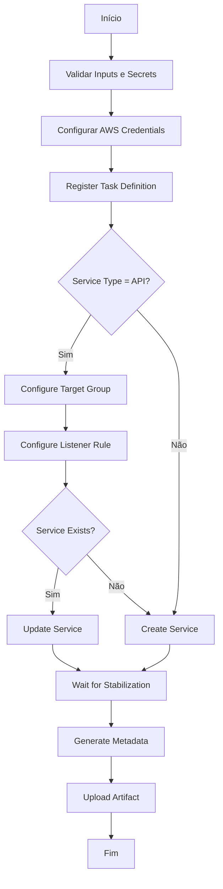
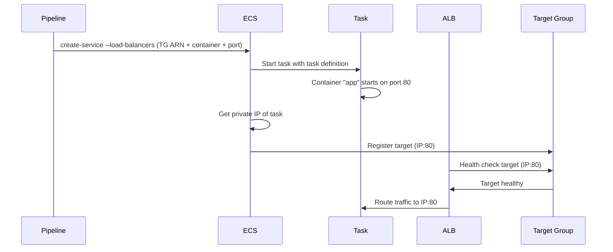

# Deploy Internals - Funcionamento Técnico do Pipeline

Documentação técnica detalhada sobre o funcionamento interno do pipeline de deploy ECS Fargate (`composite-deploy.yml`), incluindo task definitions, target groups, listeners e integração com Application Load Balancer.

## Índice

- [Visão Geral](#visão-geral)
- [Fluxo de Execução](#fluxo-de-execução)
- [Task Definition](#task-definition)
- [Target Group e Load Balancer](#target-group-e-load-balancer)
- [Deploy do Serviço ECS](#deploy-do-serviço-ecs)
- [Arquivos Temporários](#arquivos-temporários)
- [Integração ECS ↔ Target Group](#integração-ecs--target-group)
- [Deployment Strategies](#deployment-strategies)
- [Troubleshooting](#troubleshooting)

---

## Visão Geral

O workflow `composite-deploy.yml` é responsável por todo o ciclo de deploy de aplicações no Amazon ECS Fargate, incluindo:

1. **Registro de Task Definition** - Define como os containers serão executados
2. **Configuração de Target Group** - Cria/atualiza o target group do ALB (apenas APIs)
3. **Configuração de Listener Rule** - Define as regras de roteamento do ALB (apenas APIs)
4. **Deploy do Serviço ECS** - Cria ou atualiza o serviço ECS
5. **Aguarda Estabilização** - Garante que o deploy foi concluído com sucesso

### Diferenças entre APIs e Workers

| Característica | API | Worker |
|----------------|-----|--------|
| Target Group | ✅ Sim | ❌ Não |
| Listener Rule | ✅ Sim | ❌ Não |
| Load Balancer | ✅ Sim | ❌ Não |
| Health Check | ✅ ALB + ECS | ⚠️ Apenas ECS |
| Rede | Privada (AWSVPC) | Privada (AWSVPC) |

---

## Fluxo de Execução



---

## Task Definition

A Task Definition define **como** os containers serão executados no ECS Fargate.

### Comportamento Idempotente

O pipeline adota uma estratégia inteligente para task definitions:

#### Serviço já existe
- ✅ Reutiliza a task definition existente
- ✅ Atualiza apenas a imagem do container
- ✅ Faz merge idempotente de `environment` e `secrets` (por `name`)
- ✅ Preserva configurações não especificadas nos inputs

#### Serviço novo
- ✅ Cria task definition do zero
- ✅ Usa todos os inputs fornecidos
- ⚠️ Requer `ecs_task_execution_role_arn` obrigatório

### Estrutura da Task Definition

A task definition é registrada via arquivo temporário **TASK_DEF_FILE**:

```json
{
  "family": "meu-servico-api",
  "networkMode": "awsvpc",
  "requiresCompatibilities": ["FARGATE"],
  "cpu": "256",
  "memory": "512",
  "executionRoleArn": "arn:aws:iam::123456789012:role/ecsTaskExecutionRole",
  "taskRoleArn": "arn:aws:iam::123456789012:role/ecsTaskRole",
  "runtimePlatform": {
    "cpuArchitecture": "X86_64",
    "operatingSystemFamily": "LINUX"
  },
  "containerDefinitions": [
    {
      "name": "app",
      "image": "123456789012.dkr.ecr.us-east-1.amazonaws.com/meu-repo:sha-abc123",
      "portMappings": [
        {
          "name": "app-80-tcp",
          "containerPort": 80,
          "hostPort": 80,
          "protocol": "tcp",
          "appProtocol": "http"
        }
      ],
      "environment": [
        {"name": "ASPNETCORE_ENVIRONMENT", "value": "Development"},
        {"name": "LOG_LEVEL", "value": "Information"}
      ],
      "secrets": [
        {"name": "DB_PASSWORD", "valueFrom": "arn:aws:secretsmanager:..."}
      ],
      "logConfiguration": {
        "logDriver": "awslogs",
        "options": {
          "awslogs-group": "/ecs/meu-servico-api",
          "awslogs-region": "us-east-1",
          "awslogs-stream-prefix": "ecs",
          "mode": "non-blocking",
          "awslogs-create-group": "true",
          "max-buffer-size": "25m"
        }
      },
      "essential": true
    }
  ]
}
```

### Campos Principais

| Campo | Origem | Descrição |
|-------|--------|-----------|
| `family` | `ecs_service` input | Nome da família da task definition |
| `cpu` | `task_cpu` input | Unidades de CPU (256, 512, 1024, 2048, 4096) |
| `memory` | `task_memory` input | Memória em MB |
| `executionRoleArn` | `ecs_task_execution_role_arn` input | Role para pull de imagem e logs |
| `taskRoleArn` | `ecs_task_role_arn` input | Role para a aplicação (opcional) |
| `containerDefinitions[0].name` | `container_name` input | Nome do container (default: `app`) |
| `containerDefinitions[0].image` | `image_uri` input | Imagem Docker no ECR |
| `portMappings[0].containerPort` | `container_port` input | Porta exposta pelo container |

### Port Mappings

O port mapping é criado dinamicamente:

```bash
# Exemplo do script
PORT_MAPPING=$(jq -n \
  --arg name "${CONTAINER_NAME}-${PORT_NUM}-tcp" \
  --argjson port "$PORT_NUM" \
  '{name:$name,containerPort:$port,hostPort:$port,protocol:"tcp"}')

# Com appProtocol (opcional)
[ -n "$PORT_APP_PROTOCOL" ] && \
  PORT_MAPPING=$(echo "$PORT_MAPPING" | jq --arg p "$PORT_APP_PROTOCOL" '.+{appProtocol:$p}')
```

Resultado para `container_name=app`, `container_port=80`, `port_app_protocol=http`:

```json
{
  "name": "app-80-tcp",
  "containerPort": 80,
  "hostPort": 80,
  "protocol": "tcp",
  "appProtocol": "http"
}
```

### Logging Configuration

Os logs são enviados para CloudWatch Logs com as seguintes configurações:

```json
{
  "logDriver": "awslogs",
  "options": {
    "awslogs-group": "/ecs/${SERVICE_NAME}",
    "awslogs-region": "us-east-1",
    "awslogs-stream-prefix": "ecs",
    "mode": "non-blocking",
    "awslogs-create-group": "true",
    "max-buffer-size": "25m"
  }
}
```

| Opção | Valor | Descrição |
|-------|-------|-----------|
| `mode` | `non-blocking` | Evita bloqueio da aplicação se logs falharem |
| `awslogs-create-group` | `true` | Cria log group automaticamente |
| `max-buffer-size` | `25m` | Buffer máximo para logs (25 MB) |

### Merge Idempotente de Environment e Secrets

Quando o serviço já existe, o pipeline faz merge inteligente:

```bash
# Merge de environment variables (por name)
if [ -n "$CONTAINER_ENVIRONMENT" ] && [ "$CONTAINER_ENVIRONMENT" != "[]" ]; then
  TASK_DEF_JSON=$(echo "$TASK_DEF_JSON" | jq --argjson env "$CONTAINER_ENVIRONMENT" \
    '.containerDefinitions[0].environment = ([.containerDefinitions[0].environment // [] | .[], $env[]] | group_by(.name) | map(last))')
fi

# Merge de secrets (por name)
if [ -n "$CONTAINER_SECRETS" ] && [ "$CONTAINER_SECRETS" != "[]" ]; then
  TASK_DEF_JSON=$(echo "$TASK_DEF_JSON" | jq --argjson sec "$CONTAINER_SECRETS" \
    '.containerDefinitions[0].secrets = ([.containerDefinitions[0].secrets // [] | .[], $sec[]] | group_by(.name) | map(last))')
fi
```

**Comportamento:**
- Variáveis com mesmo `name` são sobrescritas
- Variáveis não especificadas são preservadas
- Input vazio (`[]`) preserva configuração existente

---

## Target Group e Load Balancer

Apenas aplicações do tipo **API** podem ter target group e listener configurados.

### Criação do Target Group

O target group **não** usa arquivo temporário. É criado via CLI com parâmetros:

```bash
aws elbv2 create-target-group \
  --name "meu-servico-api-dev-tg" \
  --protocol "HTTP" \
  --port 80 \
  --vpc-id "vpc-0abc123" \
  --target-type ip \
  --health-check-path "/" \
  --health-check-protocol "HTTP" \
  --matcher "HttpCode=200-499"
```

#### Características do Target Group

| Parâmetro | Valor | Descrição |
|-----------|-------|-----------|
| `target-type` | `ip` | **CRÍTICO**: ECS Fargate usa IPs privados das tasks |
| `protocol` | `HTTP` ou `HTTPS` | Protocolo de comunicação |
| `port` | `80` (default) | Porta do target group |
| `matcher` | `200-499` | Códigos HTTP considerados saudáveis |

⚠️ **Importante**: O `target-type ip` é essencial para ECS Fargate. O ECS registra automaticamente os IPs privados das tasks.

### Health Check

```bash
# Health check padrão
--health-check-path "/" \
--health-check-protocol "HTTP" \
--matcher "HttpCode=200-499"
```

Você pode customizar via inputs:
- `target_group_health_check_path`: Caminho do health check (ex: `/health`, `/api/health`)
- `target_group_health_check_protocol`: HTTP ou HTTPS
- `target_group_deregistration_delay_seconds`: Tempo de espera antes de remover tasks (default: 300s)

### Deregistration Delay

```bash
# Se configurado e diferente de 300 (default)
aws elbv2 modify-target-group-attributes \
  --target-group-arn "$TG_ARN" \
  --attributes "Key=deregistration_delay.timeout_seconds,Value=60"
```

Recomendado: **60-120 segundos** para APIs com requests rápidos.

### Listener Rule

A listener rule define **como** o tráfego é roteado do ALB para o target group.

#### Arquivo Temporário: COND_FILE

A listener rule usa o arquivo **COND_FILE** para definir condições de roteamento:

**Apenas Path Pattern** (default: `/${SERVICE_NAME}*`):

```json
[
  {
    "Field": "path-pattern",
    "PathPatternConfig": {
      "Values": ["/meu-servico-api*"]
    }
  }
]
```

**Apenas Host Header**:

```json
[
  {
    "Field": "host-header",
    "HostHeaderConfig": {
      "Values": ["api.meudominio.com"]
    }
  }
]
```

**Host + Path**:

```json
[
  {
    "Field": "host-header",
    "HostHeaderConfig": {
      "Values": ["api.meudominio.com"]
    }
  },
  {
    "Field": "path-pattern",
    "PathPatternConfig": {
      "Values": ["/v1/meu-servico*"]
    }
  }
]
```

#### Prioridade da Rule

```bash
# Prioridade manual
PRIORITY="$LISTENER_RULE_PRIORITY"

# Prioridade automática (max + 1)
MAX_P=$(echo "$RULES" | jq '[.Rules[]|select(.Priority!="default")|.Priority|tonumber]|max // 0')
PRIORITY=$((MAX_P + 1))
```

Se `listener_rule_priority` não for fornecido, o pipeline busca a maior prioridade existente e adiciona 1.

#### Idempotência

O pipeline verifica se já existe uma rule apontando para o target group:

```bash
TG_RULE=$(echo "$RULES" | jq -r --arg tg "$TARGET_GROUP_ARN" \
  '.Rules[]|select(.Actions[]?.TargetGroupArn==$tg)|.RuleArn' | head -1)

if [ -n "$TG_RULE" ]; then
  echo "✅ TG already associated (rule: $TG_RULE)"
else
  # Criar nova rule
fi
```

---

## Deploy do Serviço ECS

O deploy final é a criação ou atualização do serviço ECS que orquestra as tasks.

### Comportamento: Update vs Create

#### Update Service (serviço já existe)

```bash
aws ecs update-service \
  --cluster "$CLUSTER" \
  --service "$SERVICE" \
  --task-definition "$NEW_TASK_ARN" \
  --force-new-deployment \
  --enable-execute-command \
  --platform-version "1.4.0" \
  --deployment-configuration file://${CFG_FILE}
```

**Não precisa de:**
- Network configuration (já existe)
- Load balancers (já configurado)
- Capacity provider strategy (já definido)

#### Create Service (serviço novo)

```bash
aws ecs create-service \
  --cluster "$CLUSTER" \
  --service-name "$SERVICE" \
  --task-definition "$NEW_TASK_ARN" \
  --desired-count 1 \
  --network-configuration file://${NET_FILE} \
  --load-balancers file://${LB_FILE} \
  --capacity-provider-strategy file://${CP_FILE}
```

**Requer:**
- ✅ Network configuration (subnets, security groups)
- ✅ Load balancers (se `service_type=api` e TG configurado)
- ✅ Capacity provider strategy ou launch type

---

## Arquivos Temporários

O pipeline usa arquivos temporários para passar configurações complexas via JSON.

### 1. TASK_DEF_FILE (Task Definition)

**Uso:** `aws ecs register-task-definition --cli-input-json "file://${TASK_DEF_FILE}"`

**Conteúdo completo:**
```json
{
  "family": "meu-servico-api",
  "networkMode": "awsvpc",
  "requiresCompatibilities": ["FARGATE"],
  "cpu": "256",
  "memory": "512",
  "executionRoleArn": "arn:aws:iam::123456789012:role/ecsTaskExecutionRole",
  "taskRoleArn": "arn:aws:iam::123456789012:role/ecsTaskRole",
  "runtimePlatform": {
    "cpuArchitecture": "X86_64",
    "operatingSystemFamily": "LINUX"
  },
  "containerDefinitions": [
    {
      "name": "app",
      "image": "123456789012.dkr.ecr.us-east-1.amazonaws.com/repo:sha-abc",
      "portMappings": [
        {
          "name": "app-80-tcp",
          "containerPort": 80,
          "hostPort": 80,
          "protocol": "tcp",
          "appProtocol": "http"
        }
      ],
      "environment": [
        {"name": "ENV_VAR", "value": "value"}
      ],
      "secrets": [
        {"name": "SECRET", "valueFrom": "arn:aws:secretsmanager:..."}
      ],
      "logConfiguration": {
        "logDriver": "awslogs",
        "options": {
          "awslogs-group": "/ecs/meu-servico-api",
          "awslogs-region": "us-east-1",
          "awslogs-stream-prefix": "ecs",
          "mode": "non-blocking",
          "awslogs-create-group": "true",
          "max-buffer-size": "25m"
        }
      },
      "essential": true
    }
  ]
}
```

### 2. COND_FILE (Listener Rule Conditions)

**Uso:** `aws elbv2 create-rule --conditions "file://${COND_FILE}"`

**Exemplo - Path Pattern:**
```json
[
  {
    "Field": "path-pattern",
    "PathPatternConfig": {
      "Values": ["/api/v1/users*"]
    }
  }
]
```

### 3. NET_FILE (Network Configuration)

**Uso:** `aws ecs create-service --network-configuration "file://${NET_FILE}"`

**Exemplo:**
```json
{
  "awsvpcConfiguration": {
    "subnets": ["subnet-111111", "subnet-222222"],
    "securityGroups": ["sg-0abc123"],
    "assignPublicIp": "DISABLED"
  }
}
```

**Geração:**
```bash
SUBNETS=$(echo "$SUBNET_IDS" | tr ',' '\n' | jq -R . | jq -s .)
SGS=$(echo "$SECURITY_GROUPS" | tr ',' '\n' | jq -R . | jq -s .)
jq -n --argjson s "$SUBNETS" --argjson g "$SGS" --arg a "$ASSIGN_PUBLIC_IP" \
  '{awsvpcConfiguration:{subnets:$s,securityGroups:$g,assignPublicIp:$a}}' > "$NET_FILE"
```

### 4. LB_FILE (Load Balancers)

**Uso:** `aws ecs create-service --load-balancers "file://${LB_FILE}"`

**Exemplo:**
```json
[
  {
    "targetGroupArn": "arn:aws:elasticloadbalancing:us-east-1:123456789012:targetgroup/tg-name/abc123",
    "containerName": "app",
    "containerPort": 80
  }
]
```

**Geração:**
```bash
jq -n --arg tg "$TARGET_GROUP_ARN" --arg cn "$CONTAINER_NAME" --argjson cp "$PORT_NUM" \
  '[{targetGroupArn:$tg,containerName:$cn,containerPort:$cp}]' > "$LB_FILE"
```

### 5. CFG_FILE (Deployment Configuration) - Opcional

**Uso:** `aws ecs create-service --deployment-configuration "file://${CFG_FILE}"`

**Exemplo:**
```json
{
  "deploymentCircuitBreaker": {
    "enable": true,
    "rollback": true
  },
  "minimumHealthyPercent": 100,
  "maximumPercent": 200
}
```

**Geração:**
```bash
CFG=$(jq -n '{}')
if [ "$CIRCUIT_BREAKER_ENABLE" = "true" ]; then
  RB="false"; [ "$CIRCUIT_BREAKER_ROLLBACK" = "true" ] && RB="true"
  CFG=$(echo "$CFG" | jq --argjson rb "$RB" '.+{deploymentCircuitBreaker:{enable:true,rollback:$rb}}')
fi
[ -n "$DEPLOY_MIN_HEALTHY" ] && CFG=$(echo "$CFG" | jq --argjson m "$DEPLOY_MIN_HEALTHY" '.+{minimumHealthyPercent:$m}')
[ -n "$DEPLOY_MAX_PERCENT" ] && CFG=$(echo "$CFG" | jq --argjson m "$DEPLOY_MAX_PERCENT" '.+{maximumPercent:$m}')
echo "$CFG" > "$CFG_FILE"
```

### 6. CP_FILE (Capacity Provider Strategy) - Opcional

**Uso:** `aws ecs create-service --capacity-provider-strategy "file://${CP_FILE}"`

**Exemplo - FARGATE_SPOT:**
```json
[
  {
    "capacityProvider": "FARGATE_SPOT",
    "weight": 4,
    "base": 0
  }
]
```

**Exemplo - Mix FARGATE + FARGATE_SPOT:**
```json
[
  {
    "capacityProvider": "FARGATE",
    "weight": 1,
    "base": 0
  },
  {
    "capacityProvider": "FARGATE_SPOT",
    "weight": 4,
    "base": 0
  }
]
```

**Geração:**
```bash
# Input: "FARGATE_SPOT:0:4" ou "FARGATE:0:1,FARGATE_SPOT:0:4"
IFS=',' read -ra PARTS <<< "$CAPACITY_PROVIDER_STRATEGY"
for part in "${PARTS[@]}"; do
  prov=$(echo "$part"|cut -d':' -f1)
  base=$(echo "$part"|cut -d':' -f2)
  weight=$(echo "$part"|cut -d':' -f3)
  [ -z "$base" ] && base=0
  [ -z "$weight" ] && weight=1
  jq -n --arg p "$prov" --argjson w "$weight" --argjson b "$base" \
    '{capacityProvider:$p,weight:$w,base:$b}'
done
```

---

## Integração ECS ↔ Target Group

**A pergunta chave:** Como o ECS sabe quais tasks registrar no target group?

### Resposta: containerName + containerPort

O vínculo é feito através do arquivo **LB_FILE** passado ao criar o serviço:

```json
[
  {
    "targetGroupArn": "arn:aws:...:targetgroup/tg-name/abc123",
    "containerName": "app",
    "containerPort": 80
  }
]
```

### Fluxo de Integração



### Componentes-Chave

1. **targetGroupArn**: ARN do target group criado (output de `Configure Target Group`)
2. **containerName**: Nome do container na task definition (input `container_name`, default `app`)
3. **containerPort**: Porta do container na task definition (input `container_port`, default `80`)

### ⚠️ Validação Crítica

**Os valores devem bater exatamente:**

| Arquivo | Campo | Deve ser igual a |
|---------|-------|------------------|
| TASK_DEF_FILE | `containerDefinitions[0].name` | LB_FILE `containerName` |
| TASK_DEF_FILE | `portMappings[0].containerPort` | LB_FILE `containerPort` |

**Exemplo de inconsistência que causa erro:**

```json
// TASK_DEF_FILE - container name: "meu-app"
{
  "containerDefinitions": [
    {"name": "meu-app", ...}
  ]
}

// LB_FILE - container name: "app" ❌
[
  {"containerName": "app", ...}
]
```

**Erro ECS:**
```
InvalidParameterException: The container 'app' does not exist in the task definition
```

### Como o Pipeline Garante Consistência

O pipeline usa as **mesmas variáveis** em ambos os lugares:

```bash
# Step: Register Task Definition
CONTAINER_NAME="${{ inputs.container_name || 'app' }}"
CONTAINER_PORT="${{ inputs.container_port || '80' }}"
PORT_NUM=$(echo "$CONTAINER_PORT" | grep -E '^[0-9]+$' || echo "80")

# Cria container definition com name=$CONTAINER_NAME e port=$PORT_NUM
CONTAINER_DEF=$(jq -n --arg n "$CONTAINER_NAME" --argjson port "$PORT_NUM" ...)

# Step: Deploy ECS Service
CONTAINER_NAME="${{ inputs.container_name || 'app' }}"
PORT_NUM=$(echo "$CONTAINER_PORT" | grep -E '^[0-9]+$' || echo "80")

# Cria load balancer config com os mesmos valores
LB_FILE=$(mktemp)
jq -n --arg tg "$TARGET_GROUP_ARN" --arg cn "$CONTAINER_NAME" --argjson cp "$PORT_NUM" \
  '[{targetGroupArn:$tg,containerName:$cn,containerPort:$cp}]' > "$LB_FILE"
```

Portanto: **não há descoberta de "id do container"**. O pipeline usa inputs consistentes em toda a execução.

### Target Type: IP

O target group usa `--target-type ip` porque:

- ✅ ECS Fargate tasks têm IPs dinâmicos (ENIs)
- ✅ ECS registra/desregistra IPs automaticamente
- ✅ Suporta múltiplas tasks atrás do mesmo TG
- ✅ Health checks diretos nos IPs das tasks

Alternativas **não suportadas** pelo pipeline:
- ❌ `instance` - Não aplicável a Fargate (sem EC2 instances)
- ❌ `lambda` - Não aplicável a containers

---

## Deployment Strategies

### Circuit Breaker

```yaml
deployment_circuit_breaker_enable: true
deployment_circuit_breaker_rollback: true
```

**Comportamento:**
- Monitora health checks durante deploy
- Se falhas excederem limite, **rollback automático**
- Previne deploys quebrados de ficarem ativos

**Recomendado:** Sempre habilitar para ambientes produtivos.

### Deployment Percentages

```yaml
deployment_minimum_healthy_percent: 100
deployment_maximum_percent: 200
```

| Config | Min | Max | Comportamento |
|--------|-----|-----|---------------|
| **Rolling** | 100 | 200 | Cria novas tasks antes de destruir antigas (zero downtime) |
| **Blue-Green** | 0 | 200 | Cria todas as novas tasks, depois destrói antigas |
| **Conservador** | 50 | 100 | Permite até 50% indisponível durante deploy |

**Exemplo - Zero Downtime:**
- Desired count: 2 tasks
- Min 100% = Mantém 2 tasks antigas
- Max 200% = Cria 2 tasks novas (total 4 temporariamente)
- Após health check: Remove 2 antigas

### Capacity Provider Strategy

```yaml
capacity_provider_strategy: "FARGATE_SPOT:0:4"
```

**Formato:** `PROVIDER:BASE:WEIGHT[,PROVIDER:BASE:WEIGHT]`

**Exemplos:**

| Estratégia | Comportamento |
|------------|---------------|
| `FARGATE:0:1` | 100% Fargate on-demand |
| `FARGATE_SPOT:0:1` | 100% Fargate Spot (economia ~70%) |
| `FARGATE:0:1,FARGATE_SPOT:0:4` | 20% on-demand, 80% spot |
| `FARGATE:1:1,FARGATE_SPOT:0:4` | 1 task obrigatória on-demand, resto 80% spot |

**Recomendação produção:**
- Dev: 100% Spot
- Staging: Mix (20% on-demand, 80% spot)
- Produção: 100% on-demand ou 1 on-demand obrigatória + spot

### Platform Version

```yaml
platform_version: "1.4.0"
```

Versão da plataforma Fargate. **Recomendado:** `1.4.0` (suporte a ECS Exec, ephemeral storage 20GB+).

### ECS Exec

```yaml
enable_execute_command: true
```

Habilita `aws ecs execute-command` para debug remoto (equivalente a SSH em containers).

**Requer:**
- ✅ Task role com permissões SSM
- ✅ Platform version 1.4.0+
- ✅ SSM agent habilitado (default em imagens oficiais AWS)

**Uso:**
```bash
aws ecs execute-command \
  --cluster meu-cluster \
  --task abc123 \
  --container app \
  --interactive \
  --command "/bin/bash"
```

---

## Troubleshooting

### Problema: Service não fica estável

**Sintomas:**
```
Waiting for services to become stable...
Waiting for services to become stable...
[timeout após 10 minutos]
```

**Causas comuns:**

1. **Health check falhando**
   - ✅ Verificar: `target_group_health_check_path` está correto?
   - ✅ Aplicação responde 200 nesse path?
   - ✅ Container está escutando na porta correta?

2. **Security group bloqueando tráfego**
   - ✅ Verificar: Security group do ECS permite tráfego do ALB?
   - ✅ Regra de entrada: Porta do container ← Security group do ALB

3. **Subnet sem internet (para pull de imagem)**
   - ✅ Subnet privada precisa de NAT Gateway
   - ✅ Ou usar VPC endpoints para ECR + S3

**Debug:**
```bash
# Ver eventos do serviço
aws ecs describe-services --cluster CLUSTER --services SERVICE \
  --query 'services[0].events[0:10]' --output table

# Ver tasks em execução
aws ecs list-tasks --cluster CLUSTER --service-name SERVICE

# Ver logs de uma task
aws logs tail /ecs/SERVICE_NAME --follow
```

### Problema: Container não existe na task definition

**Erro:**
```
InvalidParameterException: The container 'app' does not exist in the task definition
```

**Causa:** Inconsistência entre `container_name` na task definition e no load balancer config.

**Solução:**
- ✅ Usar o mesmo valor de `container_name` input
- ✅ Verificar task definition registrada:
```bash
aws ecs describe-task-definition --task-definition FAMILY:REVISION \
  --query 'taskDefinition.containerDefinitions[*].name'
```

### Problema: Target group não recebe tráfego

**Sintomas:**
- Service está stable
- Tasks estão running
- Mas aplicação não responde via ALB

**Debug:**

1. **Verificar targets registrados:**
```bash
aws elbv2 describe-target-health --target-group-arn TG_ARN
```

Esperado:
```json
{
  "TargetHealthDescriptions": [
    {
      "Target": {"Id": "10.0.1.45", "Port": 80},
      "HealthCheckPort": "80",
      "TargetHealth": {"State": "healthy"}
    }
  ]
}
```

2. **Se targets não aparecem:**
   - ✅ Verificar `load-balancers` na service:
```bash
aws ecs describe-services --cluster CLUSTER --services SERVICE \
  --query 'services[0].loadBalancers'
```

3. **Se targets aparecem mas unhealthy:**
   - ✅ Health check path retorna 200?
   - ✅ Security group permite tráfego?
   - ✅ Container está escutando em `0.0.0.0` (não `localhost`)?

### Problema: Deploy muito lento

**Sintomas:**
- Deploy leva >15 minutos
- Tasks ficam em "draining" muito tempo

**Causas:**

1. **Deregistration delay muito alto**
   - Default: 300 segundos (5 minutos)
   - ✅ Reduzir para 30-60s para APIs com requests rápidos:
```yaml
target_group_deregistration_delay_seconds: 60
```

2. **Health check interval muito longo**
   - Default ALB: 30 segundos
   - ✅ Configurar manualmente no target group (pós-criação):
```bash
aws elbv2 modify-target-group \
  --target-group-arn TG_ARN \
  --health-check-interval-seconds 10 \
  --healthy-threshold-count 2
```

3. **Deployment strategy conservadora**
   - ✅ Usar `minimum_healthy_percent: 100` e `maximum_percent: 200`

### Problema: Task termina imediatamente

**Sintomas:**
```
Task stopped: Essential container in task exited
```

**Debug:**

1. **Ver motivo da parada:**
```bash
aws ecs describe-tasks --cluster CLUSTER --tasks TASK_ARN \
  --query 'tasks[0].stoppedReason'
```

2. **Ver logs do container:**
```bash
aws logs tail /ecs/SERVICE_NAME --follow
```

**Causas comuns:**
- ❌ Aplicação crashou no startup
- ❌ Environment variable faltando
- ❌ Secret não acessível (IAM permissions)
- ❌ Container não tem processo foreground (CMD/ENTRYPOINT incorreto)

---

## Centralização de Variáveis na Organização

### Visão Geral

A configuração de deploy (ECR, ECS, rede, load balancer) é centralizada na organização GitHub em **uma única variável por ambiente** contendo um JSON: `{ENV}_CONFIG_DEPLOY` (ex.: `SBX_CONFIG_DEPLOY`, `PRD_CONFIG_DEPLOY`). Os secrets (credenciais AWS) permanecem em variáveis separadas por ambiente (`{ENV}_AWS_ACCESS_KEY_ID`, `{ENV}_AWS_SECRET_ACCESS_KEY`). O schema do JSON e a lista completa estão em [organization-variables.md](organization-variables.md).

### Como Funciona

1. **Variável JSON na Organização**: Cada ambiente tem uma variável `{ENV}_CONFIG_DEPLOY` cujo valor é um JSON com as chaves: `ecr_registry`, `ecs_cluster`, `ecs_task_execution_role_arn`, `ecs_task_role_arn`, `subnet_ids`, `security_group_ids`, `load_balancer_name` (todas opcionais; apps que não usam uma chave podem omitir ou usar `""`).

2. **Resolução no Job `prepare`**: O job `prepare` faz um `case` por ambiente para definir `CONFIG` a partir de `vars.{ENV}_CONFIG_DEPLOY` e gravar os secrets no `GITHUB_OUTPUT`; em seguida usa `jq` para extrair cada chave do JSON e escrevê-la nos outputs. Variáveis específicas da aplicação (ex.: filas SQS, URLs de API) continuam em vars separadas no repositório e são escritas no output após o loop.

3. **Jobs Subsequentes**: Os jobs `docker` e `deploy` recebem os valores via `needs.prepare.outputs.*` (nomes dos outputs inalterados).

### Fallback para Compatibilidade

O `composite-deploy.yml` mantém fallbacks para secrets/vars diretos para garantir compatibilidade com aplicações que ainda não migraram. Aplicações novas devem **sempre** passar valores via `inputs` resolvidos no job `prepare`.

### Variáveis da Organização vs. Repositório

| Tipo | Onde | Exemplos |
|------|------|----------|
| **Organização** (config deploy) | Organization → Variables | `SBX_CONFIG_DEPLOY`, `PRD_CONFIG_DEPLOY` (JSON) |
| **Organização** (credenciais) | Organization → Secrets | `{ENV}_AWS_ACCESS_KEY_ID`, `{ENV}_AWS_SECRET_ACCESS_KEY` |
| **Repositório** (específico) | Repository → Secrets and variables | `SQS_QUEUE_URL`, `API_PROXY_URL`, `ABBYY_SECRET_ID` |

### Documentação Adicional

- [Organization Variables](organization-variables.md) - Schema do JSON e convenção (`{ENV}_CONFIG_DEPLOY` + secrets)
- [Deploy Env Pattern](deploy-env-pattern.md) - Template do step prepare com CONFIG_DEPLOY + jq
- [Troubleshooting](troubleshooting-env-vars.md) - Validação do JSON e problemas comuns

---

## Referências

- [Amazon ECS Task Definitions](https://docs.aws.amazon.com/AmazonECS/latest/developerguide/task_definitions.html)
- [ELB Target Groups](https://docs.aws.amazon.com/elasticloadbalancing/latest/application/load-balancer-target-groups.html)
- [ECS Service Load Balancing](https://docs.aws.amazon.com/AmazonECS/latest/developerguide/service-load-balancing.html)
- [ECS Deployment Circuit Breaker](https://docs.aws.amazon.com/AmazonECS/latest/developerguide/deployment-circuit-breaker.html)
- [Fargate Platform Versions](https://docs.aws.amazon.com/AmazonECS/latest/developerguide/platform_versions.html)

---

## Próximos Passos

- Para uso básico dos workflows: Ver [`workflows.md`](workflows.md)
- Para configuração de environments: Ver [`environments.md`](environments.md)
- Para diagramas visuais: Ver [`diagramas.md`](diagramas.md)
