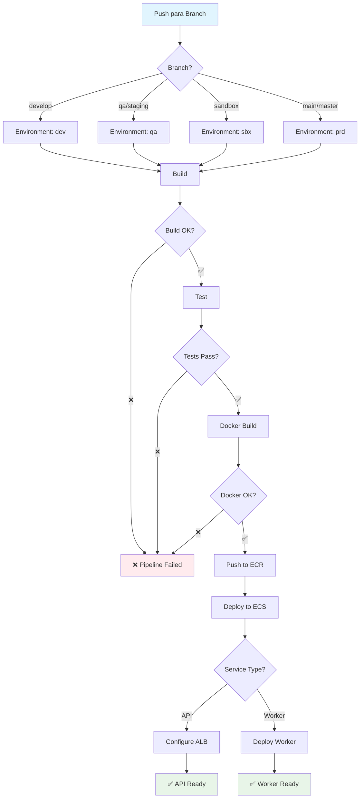
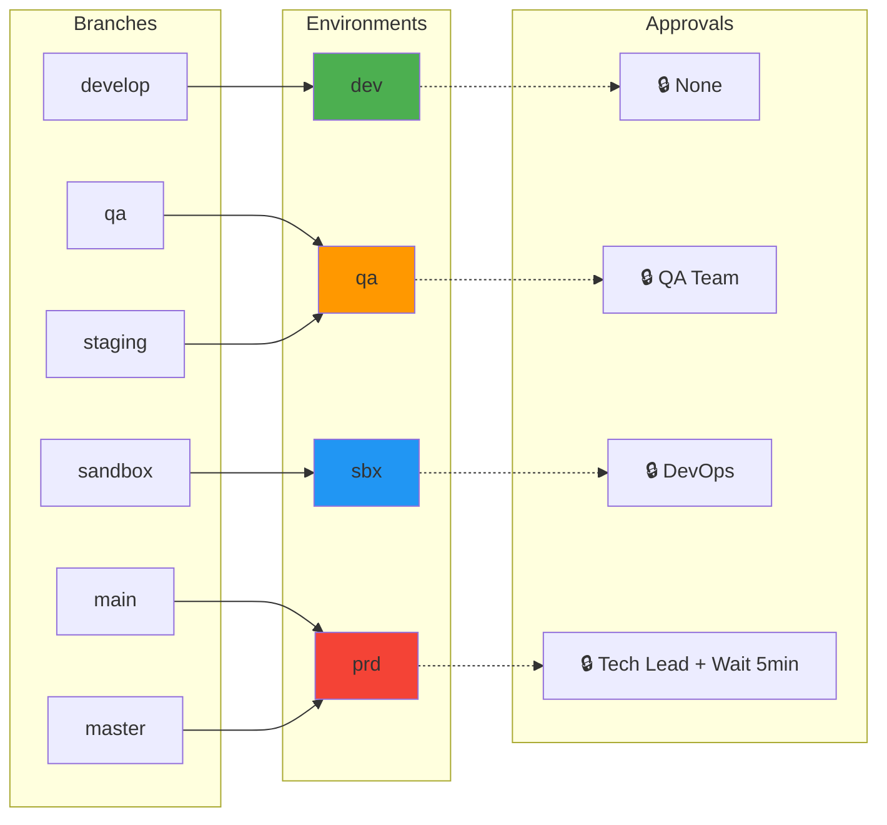
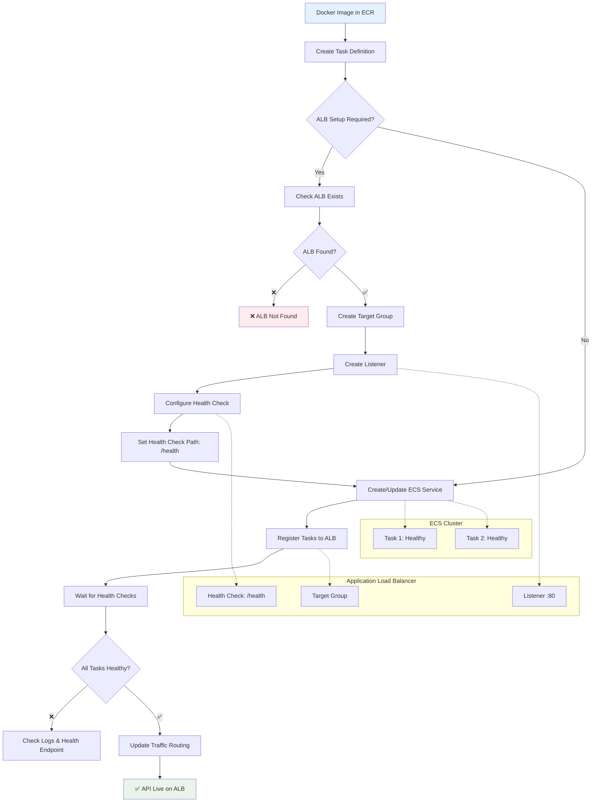
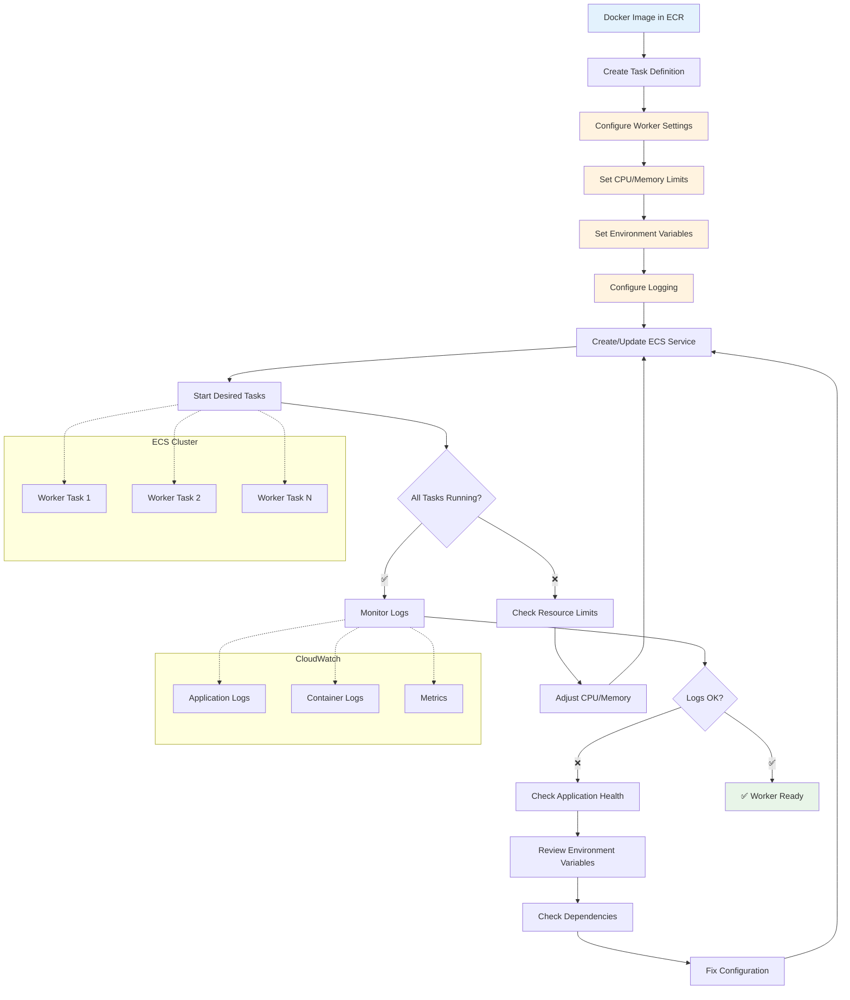
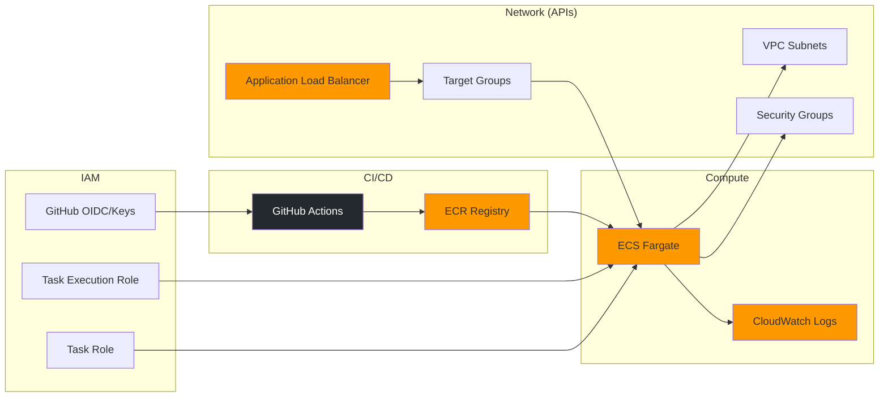

# Diagramas do Pipeline

Visualizações dos fluxos e arquitetura do pipeline CI/CD usando diagramas Mermaid.

## 1. Fluxo Completo do Pipeline

Visão geral de todo o pipeline desde o push até o deploy.

## 2. Mapeamento Branch → Environment

Como as branches são mapeadas para environments (usados para aprovações e proteções). A **config de deploy** (ECR, ECS, rede, ALB) vem da **organização** (variável `{ENV}_CONFIG_DEPLOY` + secrets), não dos environments do repositório.

## 3. Deploy API com Application Load Balancer

Fluxo detalhado de deploy para APIs com ALB e Target Groups.

## 4. Deploy Worker (Fluxo Simplificado)

Deploy de workers/background services sem Load Balancer.

## Fluxos por Tipo de Serviço

### APIs (com ALB)
- ✅ Recebem tráfego HTTP/HTTPS externo
- ✅ Health checks automáticos
- ✅ Load balancing entre múltiplas tasks
- ✅ Traffic routing baseado em path/host
- ⚠️ Requer configuração de Target Group e Listener

### Workers (sem ALB)
- ✅ Processamento em background
- ✅ Escalonamento baseado em CPU/Memory
- ✅ Logs centralizados no CloudWatch
- ⚠️ Sem health checks de rede automáticos
- ⚠️ Monitoramento baseado em logs/métricas

## Recursos AWS Utilizados

## Interpretando os Diagramas

### Símbolos e Cores

- 🔵 **Azul**: Processos de build/docker
- 🟢 **Verde**: Sucessos/endpoints prontos
- 🟠 **Laranja**: Configurações/variáveis
- 🔴 **Vermelho**: Failures/erros
- 🔒 **Cadeado**: Approvals/proteções necessárias
- ✅ **Check**: Validações bem-sucedidas
- ❌ **X**: Falhas que interrompem pipeline

### Pontos de Falha Comuns

1. **Build Stage**: Erros de compilação, dependências faltando
2. **Test Stage**: Testes falhando, cobertura insuficiente
3. **Docker Stage**: Dockerfile incorreto, push ECR sem permissão
4. **Deploy Stage**: Configuração de rede incorreta, health checks falhando

### Monitoramento

- **CloudWatch**: Logs de aplicação e container
- **ECS Console**: Status das tasks e services
- **ALB Console**: Health dos targets (apenas APIs)
- **GitHub Actions**: Logs detalhados de cada stage

## Próximos Passos

- Para config de deploy na organização (variável JSON + secrets): Ver [organization-variables.md](organization-variables.md) e [deploy-env-pattern.md](deploy-env-pattern.md)
- Para configurar environments no repositório (aprovações, wait timer): Ver [environments.md](environments.md)
- Para detalhes dos workflows: Ver [workflows.md](workflows.md)
- Para adaptar para seu projeto: Ver [adaptacao.md](adaptacao.md)