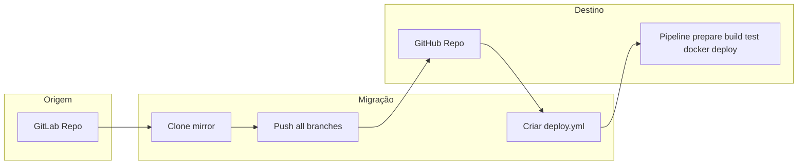

# Guia de Migração de Serviços: GitLab → GitHub e Pipeline ECS

Este guia descreve o passo a passo para migrar repositórios do GitLab para o GitHub (com **todas as branches**) e configurar o pipeline de deploy (prepare → build → test → docker → deploy) no repositório compartilhado `invoisys/infra-ci-cd`. Inclui orientações por tipo de serviço: **já ECS** (apenas migração de repositório) e **ex-EKS** (ajustes de código: SDK invoisys, path base ALB e variáveis de ambiente).

## Fluxo geral



---

## 1. Importação GitLab → GitHub (todas as branches via CLI)

A importação pela [interface do GitHub](https://docs.github.com/en/get-started/importing-your-projects-to-github/importing-source-code-to-github/importing-a-repository-with-github-importer) não garante que **todas as branches** sejam importadas. Para preservar histórico e todas as refs, use clone com mirror e push via linha de comando.

### Pré-requisitos

- Repositório **já criado no GitHub** (vazio, sem commits).
- Acesso ao repositório no GitLab (HTTPS ou SSH).
- Git instalado localmente.

### Passo a passo

1. **Clone com mirror do GitLab**  
   Isso copia todas as branches, tags e refs, sem checkout de working tree.

   ```bash
   git clone --mirror <url-gitlab-repo>
   ```

   Exemplo: `git clone --mirror https://gitlab.com/grupo/meu-servico.git`

2. **Entrar no diretório do clone**  
   O diretório terá sufixo `.git` (ex.: `meu-servico.git`).

   ```bash
   cd meu-servico.git
   ```

3. **Configurar o remote do GitHub**  
   Adicione o GitHub como remote (ex.: `github`). Se quiser manter o GitLab como `origin`, apenas adicione:

   ```bash
   git remote add github <url-github-repo>
   ```

   Exemplo: `git remote add github https://github.com/invoisys/meu-servico.git`

   Alternativa: remover `origin` e adicionar o GitHub como `origin`:

   ```bash
   git remote remove origin
   git remote add origin <url-github-repo>
   ```

4. **Enviar todas as branches e refs para o GitHub**

   ```bash
   git push github --all
   git push github --tags
   ```

   Se tiver usado `origin` para o GitHub: substitua `github` por `origin`.

### Observações

- **LFS**: Se o repositório usar Git LFS, configure o LFS no clone e repita o push (ou use ferramentas de migração que suportem LFS).
- **Proteção de branches**: Após o push, configure branch protection rules no GitHub conforme a política da organização.
- **Remoção do remote GitLab**: Depois de validar o conteúdo no GitHub, pode remover o remote GitLab: `git remote remove github` (ou o nome usado).

### Referência

- [Importar repositório com GitHub Importer](https://docs.github.com/en/get-started/importing-your-projects-to-github/importing-source-code-to-github/importing-a-repository-with-github-importer) — a UI é útil para repositórios simples; para **todas as branches**, o fluxo via CLI acima é recomendado.

---

## 2. Criar deploy.yml e usar o pipeline

O pipeline de deploy é composto por jobs reutilizáveis (composites) do repositório `invoisys/infra-ci-cd`. O workflow fica no **repositório do serviço**, em `.github/workflows/deploy.yml`.

### Ordem dos jobs

1. **prepare** — Resolve ambiente (branch), lê a variável de organização `vars.{ENV}_CONFIG_DEPLOY`, faz parse com `jq` e grava outputs (ecr_registry, ecs_cluster, subnet_ids, security_group_ids, load_balancer_name, aws_role_arn, etc.).
2. **build** — Compila o código (.NET ou Node).
3. **test** — Executa testes e opcionalmente gera cobertura.
4. **docker** — Build da imagem e push para o ECR.
5. **deploy** — Deploy no ECS Fargate (API com ALB ou Worker).

Cada job usa `needs` para depender dos anteriores; `docker` e `deploy` consomem os outputs do `prepare` e, quando aplicável, do `docker` (ex.: `full_image_uri`).

### Onde fica o workflow

- **Arquivo:** `.github/workflows/deploy.yml` no repositório do **serviço** (não no infra-ci-cd).
- **Repositório compartilhado:** Os composites são referenciados como `invoisys/infra-ci-cd/.github/workflows/composite-*.yml@main` (ou use caminho local se estiver no mesmo monorepo).

### Job prepare

- **Template:** Use o padrão descrito em [deploy-env-pattern.md](deploy-env-pattern.md): `case` por ambiente (dev, qa, sbx, prd), leitura de `vars.{ENV}_CONFIG_DEPLOY`, loop com `jq` para extrair chaves do JSON e escrita em `GITHUB_OUTPUT`.
- **Variáveis de organização:** Config de deploy (ECR, ECS, rede, load balancer) em uma variável JSON por ambiente; secrets AWS em `{ENV}_AWS_ACCESS_KEY_ID` e `{ENV}_AWS_SECRET_ACCESS_KEY`, ou uso de **OIDC** (`aws_role_arn`) quando já adotado.
- **Outputs típicos:** `ecr_registry`, `ecs_cluster`, `ecs_task_execution_role_arn`, `ecs_task_role_arn`, `subnet_ids`, `security_group_ids`, `load_balancer_name`, `aws_role_arn`. Inclua também `deployment_name`, `project_name`, `technology`, `technology_version`, `working_directory`, `service_type`, `aws_region` quando forem usados nos jobs seguintes.

### Jobs build e test

- **Tecnologia:** `technology: dotnet` ou `node`, `technology_version` (ex.: 8.0, 20), `working_directory` (ex.: `src`), `project_name` quando for .NET (nome do .csproj).
- Documentação completa dos inputs: [workflows.md — composite-build e composite-test](workflows.md#composite-build).

### Job docker

- **Principais inputs:** `ecr_repo`, `service_type` (api | worker), `environment`, `ecr_registry`, `aws_role_arn` (OIDC). Opcional: `use_template_dockerfile`, `templates_repo`, `templates_ref`, `dockerfile_path`, `project_name`, `build_context`.
- **Secrets:** Se não usar OIDC, use `AWS_ACCESS_KEY_ID` e `AWS_SECRET_ACCESS_KEY` (por exemplo vindos de `needs.prepare.outputs`).
- Documentação: [workflows.md — composite-docker](workflows.md#composite-docker).

### Job deploy

- **Obrigatórios:** `image_uri`, `ecs_service`, `environment`, `service_type`, `ecs_cluster`; quando usar OIDC, `aws_role_arn`.
- **Rede:** `subnet_ids`, `security_group_ids` (normalmente do prepare).
- **APIs com ALB:**  
  - `create_target_group_and_listener: true`  
  - `load_balancer_name` (ou `load_balancer_arn`)  
  - `target_group_name`, `target_group_port`, `target_group_health_check_path`  
  - `listener_rule_path_pattern` (ex.: `/api/inb/fatura/proxy/*`)  
  - `listener_rule_host_header` (ex.: `api.${{ github.ref_name }}.internal.invoisys.io`)  
  - Opcional: `listener_rule_priority`, `listener_port`
- **Variáveis e secrets do container:** `container_environment`, `container_secrets` (JSON).
- Documentação completa: [workflows.md — composite-deploy](workflows.md#composite-deploy) e [.github/workflows/composite-deploy.yml](../.github/workflows/composite-deploy.yml) (inputs linhas 8–206).

### Tabela resumo: qual composite usar

| Tipo de serviço   | Composite principal              | Observação |
|-------------------|----------------------------------|------------|
| API ECS           | composite-deploy.yml             | Use prepare + build + test + docker + deploy; para ALB: load_balancer_name, listener_rule_* |
| Worker ECS        | composite-deploy.yml             | Sem ALB; prepare + build + test + docker + deploy |
| Lambda            | composite-deploy-lambda.yml      | Build/package e prepare específicos; ver [deploy-lambda.md](deploy-lambda.md) e [examples/deploy-lambda-example.yml](examples/deploy-lambda-example.yml) |

---

## 3. Migração por tipo: serviços que já estavam no ECS

Para serviços que **já rodavam no ECS** (API ou Worker), a migração resume-se a: (1) importar o repositório do GitLab para o GitHub; (2) criar `.github/workflows/deploy.yml` (e opcionalmente `ci.yml` só build+test) com base no pipeline descrito na seção 2; (3) escolher o exemplo de referência conforme o perfil abaixo.

### Escolha do exemplo de referência

| Perfil | Exemplo | Observação |
|--------|---------|------------|
| API .NET sem path base no ALB | api.customlookupdata | prepare enxuto (ecr_registry, ecs_cluster, aws_role_arn), OIDC, sem LB avançado |
| API .NET com host/path no ALB | platform-api-dados-bancarios-recebimento | load_balancer_name, listener_rule_host_header, listener_rule_path_pattern, target_group_* |
| Worker .NET com Dockerfile próprio | nfeepechandler | `use_template_dockerfile: false`, `dockerfile_path`, `project_name` |

Arquivos de referência direta no repositório de exemplos (se disponível localmente):

- API simples: `exemplos-migracao-github/api.customlookupdata/.github/workflows/deploy.yml`
- API com ALB: `exemplos-migracao-github/platform-api-dados-bancarios-recebimento/.github/workflows/deploy.yml`
- Worker com Dockerfile próprio: `exemplos-migracao-github/nfeepechandler/.github/workflows/deploy.yml`

### Passos práticos

1. Executar o [import GitLab → GitHub](#1-importação-gitlab--github-todas-as-branches-via-cli) (todas as branches).
2. Criar `.github/workflows/deploy.yml` a partir do template do pipeline (seção 2), copiando o exemplo escolhido e ajustando:
   - **prepare:** `deployment_name`, `project_name`, `ecr_repo` (inbound/platform/outbound conforme convenção), e garantir que as variáveis de organização (`{ENV}_CONFIG_DEPLOY` e secrets ou OIDC) estão configuradas.
3. Configurar na **organização** GitHub: variáveis `{ENV}_CONFIG_DEPLOY` (JSON) e secrets `{ENV}_AWS_*` ou OIDC, conforme [deploy-env-pattern.md](deploy-env-pattern.md).

---

## 4. Migração ex-EKS: ajustes de código e deploy

Serviços que vêm do **EKS** (ex.: API.Fatura, AgendadorNFSe, SendToABBYY) exigem, além do import e do deploy.yml, ajustes de código e configuração descritos abaixo.

### 4.1 SDK Invoisys (ex-EKS .NET)

- Atualize os pacotes NuGet **invoisys.SDK\*** e **invoisys.DataModels\*** para versões compatíveis com o runtime ECS atual (ex.: 1.8.x para SDK; 3.0.x para DataModels, conforme exemplos).
- **Referência:** [AgendadorNFSe.csproj](../../exemplos-migracao-github/AgendadorNFSe/src/AgendadorNFSe/AgendadorNFSe.csproj): invoisys.SDK 1.8.2, invoisys.SDK.Message 1.2.8; [API.Fatura.csproj](../../exemplos-migracao-github/API.Fatura/src/API.Fatura/API.Fatura.csproj): invoisys.SDK.* 1.8.2, invoisys.DataModels.* 3.0.7.
- **Na execução:** Analise o histórico Git dos repositórios reais (commits de atualização de .csproj) para documentar versões antigas → novas e breaking changes, se houver, e incorpore ao guia ou a um runbook do serviço.

### 4.2 API atrás do ALB com path base

A aplicação deve responder no **mesmo path** que a listener rule do ALB (ex.: `/api/inb/fatura/proxy`).

- **ASP.NET Core:** use `app.UsePathBase(pathBase)` com o mesmo valor que será usado no ALB. Exemplo em [API.Fatura Program.cs](../../exemplos-migracao-github/API.Fatura/src/API.Fatura/Program.cs):

  ```csharp
  const string pathBase = "/api/inb/fatura/proxy";
  // ...
  app.UsePathBase(pathBase);
  ```

- **No deploy.yml:** alinhe com o composite-deploy:
  - `listener_rule_path_pattern`: ex. `'/api/inb/fatura/proxy/*'`
  - `listener_rule_host_header`: ex. `'api.${{ github.ref_name }}.internal.invoisys.io'`
  - `target_group_health_check_path`: `/` ou `/health` (considerando o path base da aplicação).
- **Referência:** [API.Fatura deploy.yml](../../exemplos-migracao-github/API.Fatura/.github/workflows/deploy.yml) (listener_rule_path_pattern, listener_rule_host_header, target_group_*).

### 4.3 Workers ex-EKS

- **AgendadorNFSe:** além do SDK (acima), garanta variáveis de ambiente e conexões (filas, DB, etc.) iguais ao que existia no EKS; o deploy é igual aos outros workers ECS (sem ALB). Use [AgendadorNFSe deploy.yml](../../exemplos-migracao-github/AgendadorNFSe/.github/workflows/deploy.yml) como base.
- **SendToABBYY (Node):** mapeie variáveis (QUEUE_URL, API_PROXY_URL, ABBYY_SECRET_ID, S3, etc.) no job **prepare** (variáveis por ambiente na organização) e em **container_environment** no job deploy. Use [SendToABBYY deploy.yml](../../exemplos-migracao-github/SendToABBYY/.github/workflows/deploy.yml) como template (prepare com `sqs_queue_url`, `url_api_proxy`, `abbyy_secret_id` e container_environment correspondente).

### 4.4 Checklist EKS → ECS

- [ ] Atualizar SDK invoisys (e data models) e validar build e testes.
- [ ] **(APIs)** Configurar path base na aplicação e no deploy.yml (`listener_rule_path_pattern`, `listener_rule_host_header`, `target_group_health_check_path`).
- [ ] **(Workers)** Revisar variáveis de ambiente e secrets; replicar no prepare e em `container_environment`.
- [ ] Executar import GitLab → GitHub e criação de deploy.yml conforme seções 1 e 2.

---

## 5. Lambda

Para migração de funções **Lambda**, o pipeline usa o composite **composite-deploy-lambda**. O fluxo (build → test → package → deploy) e os inputs são diferentes do ECS.

- **Documentação:** [deploy-lambda.md](deploy-lambda.md)
- **Exemplo de workflow:** [docs/examples/deploy-lambda-example.yml](examples/deploy-lambda-example.yml)

Triggers (API Gateway, SQS, EventBridge, etc.) **não** são configurados pelo workflow e devem ser definidos separadamente (Console AWS, CLI, Terraform ou CloudFormation).

---

## 6. Classificação dos exemplos (referência rápida)

| Projeto | Tipo | Origem | Observação |
|---------|------|--------|------------|
| API.Fatura | API .NET | EKS→ECS | Path base ALB + SDK invoisys; `UsePathBase` em Program.cs |
| AgendadorNFSe | Worker .NET | EKS→ECS | SDK invoisys no .csproj |
| SendToABBYY | Worker Node | EKS→ECS | Variáveis de app (SQS, API_PROXY_URL, ABBYY) no prepare e container_environment |
| api.customlookupdata | API .NET | Já ECS | deploy.yml enxuto; sem ALB avançado |
| nfeepechandler | Worker .NET | Já ECS | `use_template_dockerfile: false`, Dockerfile próprio |
| platform-api-dados-bancarios-recebimento | API .NET | Já ECS | listener_rule_host_header e path no ALB |

---

## Referências

- [README do pipeline](../README.md) — quick start e variáveis de organização
- [workflows.md](workflows.md) — inputs/outputs dos composites (build, test, docker, deploy)
- [deploy-env-pattern.md](deploy-env-pattern.md) — job prepare, `vars.{ENV}_CONFIG_DEPLOY`, case por ambiente, jq, outputs
- [deploy-lambda.md](deploy-lambda.md) e [examples/deploy-lambda-example.yml](examples/deploy-lambda-example.yml) — deploy Lambda
